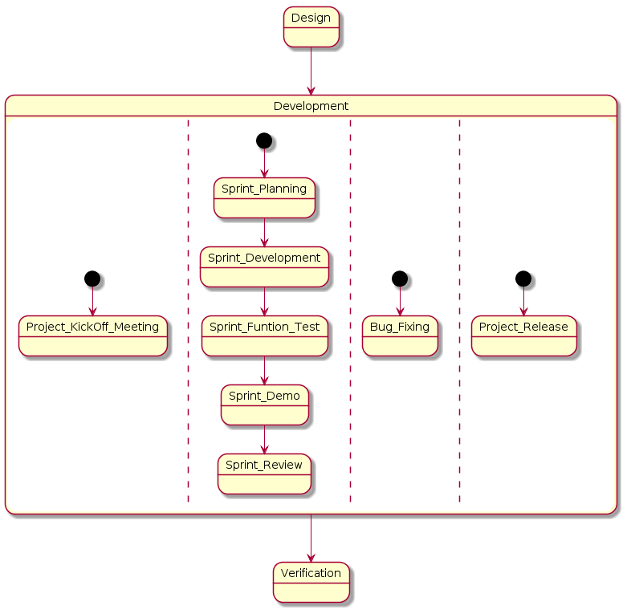
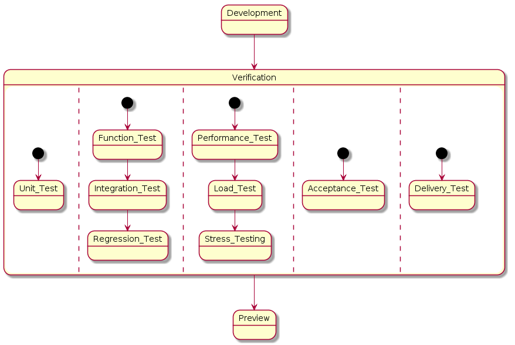
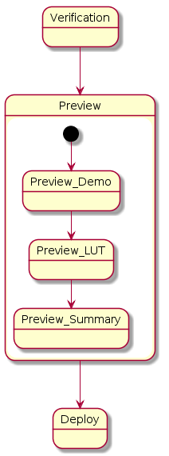
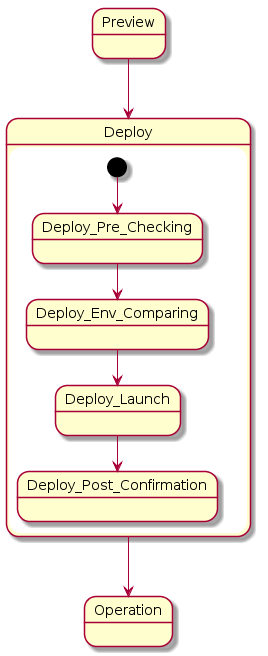

.. 以两个点开始的内容是注释。不会出现编写的文档中。但是能体现文档书写者的思路。
.. 一般一个文件，内容，逻辑的分层，分到三级就可以， 最多四级. 也就是 
   H1. ########
   H2, ********
   H3, =================================================================
   H4. ---------
   

Overall Picture
###################################################

Background
****************************

.. 这个文档设计的背景，为何要设计这个文档，这个文档的来源基础，设计基础是什么之类的信息。

.. The Service-Dev team is a new team foucses on service and cloud development and web application delivery.
.. But there are no exist development process or practicable guideline in China local site to guide development on service area.

索尼移动一直致力于移动平台的产品创新和产品开发技术的发展。但在移动互联网迅速发展的时代，移动平台的产品对服务器及云端支持的需求，变得越来越重要，不可或缺。 因此，基于公司原有移动产品开发流程的经验，与服务端开发团队最佳时间相结合，编写此服务端软件开发流程，供其它服务端开发团队开发人员或者测试人员参考。

Goals
****************************

.. 解释这个文档中会涉及到的一些专业属于，如何让别人很容易文档中所描述的。

.. We make this documents based on the best practices on developers,so we want to make this docs to describe
.. how we can develop a service system, from ideas to real running service system.

此开发流程需要达到的目的如下：

#. 总结对服务端开发团队共有的开发阶段和活动。
#. 开发阶段和活动的定义和详细程度，一般涉及到共有的信息，会加以描述。对具体到某一个开发团队才涉及到的信息，不在此文档中描述。
#. 此开发流程对开发人员和测试人员来说，需要对整体的开发流程，以及每个开发阶段内涉及的子任务应该具有指导意义。
#. 对每个开发流程中涉及的比子任务更详细的子子任务，但是不是属于共有的开发任务，不进行描述。
#. 此流程的读者对象是开发人员和测试人员为主，其它涉及的人员为次。

Overall Picture for Process
**************************************

整体流程有如下说明

#. 流程分为七个阶段：需求分析、设计、开发、测试、预演、部署、运营
#. 流程为迭代式开发模式流程，不是瀑布型开发流程。也就是说，在运营阶段收集新需求和市场反馈，会跌掉到下一个开发的需求阶段，进行下一个迭代开发。
#. 借鉴现有开发流程的有4个： 需求分析、设计、开发、测试阶段
#. 新涉及的服务端开发流程有3个：预演、部署、运营

需求分析::

	通过与需求方沟通，对需求进行详细的分析和整理，并形成需求文档，为需求的设计人员提供业务要求支持。需求决定了软件产品最终的开发输出时候达到了最初的业务目标。

设计::
	
	软件设计的任务是从软件需求规格说明书出发，根据需求分析阶段确定的功能,设计软件系统的整体结构、划分功能模块、确定每个模块的实现算法以及编写具体的代码，形成软件的具体设计方案。

开发::
	
	开发阶段根据输入的需求和设计方案，对软件系统新功能进行编码和实现，并由开发人员进行功能测试，最终交付高质量可测试的软件包。

测试::
	
	以设计好的测试用例为基准，使用人工或者自动化工具，对软件进行功能和性能方面的测试工作，以保证软件功能质量得以保证，并且检验是否满足规定的需求。·

预演::
	
	模拟实际生产环境，对服务器软件进行部署预演，在一定范围内以最终用户的角度，对软件的功能验证。同时对可能在上线部署中出现的问题作最大的规避。

部署::
	
	对服务器软件进行生产环境的发布和部署，根据实际情况将稳定版本或新功能版本推送给最终用户。

运营::
	
	对运行中的服务功能进行监控，维护保证服务可靠可用；收集用户统计数据，分析总结新功能是否达到预期，并为下一轮迭代新需求提供数据支撑。

.. image:: images/01_overall_pictures.png
   :scale: 70

.. #. Requirement
..	Requirements analysis in systems engineering and software engineering, encompasses those tasks that go into determining the needs or conditions to meet for a new or altered product, taking account of the possibly conflicting requirements of the various stakeholders, analyzing, documenting, validating and managing software or system requirements.
.. #. Design		
..	Software design is the process by which an agent creates a specification of a software artifact, intended to accomplish goals, using a set of primitive components and subject to constraints. Software design may refer to either "all the activities involved in conceptualizing, framing, implementing, commissioning, and ultimately modifying complex systems" or "the activity following requirements specification and before programming"
.. #. Development	
..	Software development is the process of writing and maintaining the source code, whose goals are ultimate implementation of the planned features and product delivery. 
.. #. Verification	
..	Software testing is an investigation conducted to provide stakeholders with information about the quality of the product or service under test.[1] Software testing can also provide an objective, independent view of the software to allow the business to appreciate and understand the risks of software implementation. Test techniques include, but are not limited to, the process of executing a program or application with the intent of finding software bugs (errors or other defects).
.. #. Preview		
..	Preview version software is often useful for demonstrations and previews within an organization and to prospective customers, and customer of the organization that develops the software willing to test the software and feeback for bugfix and new requirement collection. 
.. #. Deploy		
..	The general deployment process consists of several interrelated activities with possible transitions between them, such as "Release", "Install and activate", "Deactivate", "Version tracking", "Uninstall" and so on.
.. #. Operation	
..	Secure that all relevant stakeholder are aware of and are continuously updated on planned and un-planned disruptions.

Introduction of Phases
**************************************

Requirement
===============================================================================

通过与需求方沟通，对需求进行详细的分析和整理，并形成需求文档，为需求的设计人员提供业务要求支持。需求决定了软件产品最终的开发输出时候达到了最初的业务目标。

.. image:: images/02_requirement_Intro.png
   :scale: 70

MRD
---------
Market Requirement Document, 市场需求文档。 该文档是产品项目由“准备”阶段进入到“实施”阶段的第一文档，其作用就是“对年度产品中规划的某个产品进行市场层面的说明”，这个文档的质量好坏直接影响到产品项目的开展，并直接影响到公司产品战略意图的实现。

PRD
---------
Product Requirement Document，产品需求文档。该文档在产品项目中是一个“承上启下”的作用，“向上”是对MRD内容的继承和发展，“向下”是要把MRD中的内容技术化，向研发部门说明产品的功能和性能指标。

Feasibility Report
---------
可行性研究报告。分析论证该项目活动是否切实可行而提出的一种书面材料，主要分析在技术上是否可以实现和如何才能取得最佳效益。

Design
==================================================================================

软件设计的任务是从软件需求规格说明书出发，根据需求分析阶段确定的功能,设计软件系统的整体结构、划分功能模块、确定每个模块的实现算法以及编写具体的代码，形成软件的具体设计方案。

.. image:: images/03_design_Intro.png
   :scale: 70

Blueprint Design
---------
交换设计文档，主要包括界面交互流程，每个界面的元素设计等等。

Corevisual Design
---------
根据Blueprint Design文档，对实际视觉效果的进一步设计。

Architecture Design
---------
架构设计。根据需求进行架构设计，包括系统的外在的接口设计，内在的模块设计。为后续的详细设计和开发提供指导。

Module Interface Design
---------
模块接口设计。主要对系统模块之间的接口进行设计，明确各个模块之间的关系。

Test Case Design
---------
测试用例设计。根据需求设计测试用例，作为后续测试过程的输入。

Development
===================================================================================

开发阶段根据输入的需求和设计方案，对软件系统新功能进行编码和实现，并由开发人员进行功能测试，最终交付高质量可测试的软件包。

Project Kick Off Meeting
---------
项目启动会。在项目正式开始执行之前，召集项目所有相关人员，对项目的范围，进度，人员安排，风险等进行阐述。

Sprint Planning
---------
Sprint规划。规划sprint的时间，任务。讨论并确定开发任务的详细设计。将所有的任务细分成粒度合适的子任务，并估算子任务的工作量。

Sprint Development
---------
Sprint开发。开发并完成sprint中所有的任务。

Sprint Function Test
---------
Sprint功能测试。对sprint中开发完成的功能进行测试，并产生问题列表。

Sprint Demo
---------
Sprint演示。邀请相关人员，对sprint以完成的功能进行演示，并获取反馈。

Sprint Review
---------
Sprint回顾。对sprint中的经验教训进行总结并形成文档，在后续的sprint中进行提高和拓展。

Bug Fixing
---------
问题修复。对已发现的问题进行修复，以完善开发的功能。

Sprint Release
---------
将sprint中完成的功能和项目成果发布出来。

Verification
====================================================================================

以设计好的测试用例为基准，使用人工或者自动化工具，对软件进行功能和性能方面的测试工作，以保证软件功能质量得以保证，并且检验是否满足规定的需求。

Unit Test
---------
单元测试。对软件中的最小可测试单元进行检查和验证。

Function Test
---------
功能测试。对产品的各功能进行验证，根据功能测试用例，逐项测试，检查产品是否达到用户要求的功能。

Integration Test
---------
集成测试。也叫组装测试或联合测试。在单元测试的基础上，将所有模块按照设计要求（如根据结构图〕组装成为子系统或系统，进行集成测试。

Regression Test
---------
回归测试。修改了旧代码后，重新进行测试以确认修改没有引入新的错误或导致其他代码产生错误。

Performance Test
---------
性能测试。通过自动化的测试工具模拟多种正常、峰值以及异常负载条件来对系统的各项性能指标进行测试。负载测试和压力测试都属于性能测试，两者可以结合进行。通过负载测试，确定在各种工作负载下系统的性能，目标是测试当负载逐渐增加时，系统各项性能指标的变化情况。压力测试是通过确定一个系统的瓶颈或者不能接收的性能点，来获得系统能提供的最大服务级别的测试。

Acceptance Test
---------
验收测试。通过验收测试，以确定是否满足需求规范的要求。

Delivery Test
---------
NA

Preview
====================================================================================

模拟实际生产环境，对服务器软件进行部署预演，在一定范围内以最终用户的角度，对软件的功能验证。同时对可能在上线部署中出现的问题作最大的规避。

Preview Demo
---------
预演演示。在预演的环境上对所有功能进行演示，并收集反馈。

Preview LUT
---------
预演LUT。在预演环境上模拟最终用户，对功能进行测试，并收集反馈。

Preview Summary
---------
预演总结。对预演演示和LUT的结果进行总结，并给出相应的行动列表。

Deploy
=====================================================================================
对服务器软件进行生产环境的发布和部署，根据实际情况将稳定版本或新功能版本推送给最终用户。

Deploy Pre Checking
---------
部署前检查。在部署前对相关因素进行检查，以确保部署没有问题。

Deploy Env Comparing
---------
部署环境比较。对部署的环境和预演的环境进行比较，确定环境没有差异。或者有差异，但是不会对部署结果产生任何影响。

Deploy Launch
---------
部署实施。

Deploy Post Confirmation
---------
部署后确认。部署完后对部署结果做进一步确认没有任何问题。

Operation
=====================================================================================
对运行中的服务功能进行监控，维护保证服务可靠可用；收集用户统计数据，分析总结新功能是否达到预期，并为下一轮迭代新需求提供数据支撑。

.. image:: images/08_operation_intro.png
   :scale: 70

Operation Launch
---------
运营实施。实施运营。

Operation Auto Monitor
---------
运营自动监控。自动监控运营状况，并产生运营相关数据。

Operation BizData Collection
---------
与运营方合作，索取对新功能的用户反馈和统计数据。

Operation BizData Anylasis
---------
通过用户反馈和统计数据，对新功能的实际效果作分析和评估。

Operation Next Preparation
---------
根据分析报告提出对下一次系统更新或功能增强的建议。

Reference for overall sub taskes
=====================================================================================

.. image:: images/01_1_overall_picture_sub_tasks.png
   :scale: 70

