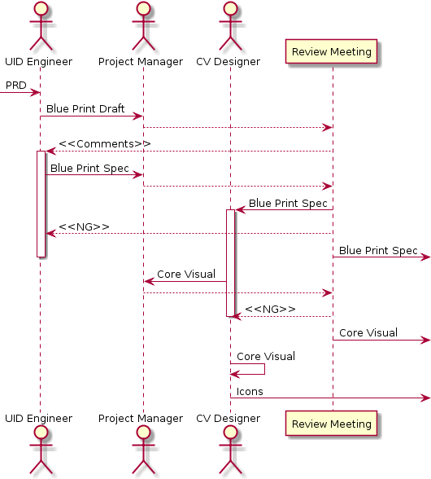

.. 以两个点开始的内容是注释。不会出现编写的文档中。但是能体现文档书写者的思路。
.. 一般一个文件，内容，逻辑的分层，分到三级就可以， 最多四级. 也就是 
   H1. ####################################################
   H2, ****************************************************
   H3, ============================================================================================================================================================================================================================================================================================================================================
   H4. ---------
   
Design
###################################################

#. Process Flow

	.. image:: images/03_design_Intro.png

#. Entry Criteria

	Requirement Documentation Ready

	* MRD
	* PRD
	* User Stories

#. Exit Criteria

	Design Documentation

	* Blue print
	* Core visual
	* Overall Arch Design

Task -- UI Design
***************************************************

Target: What we want?: What we want?
===============================================================================
* Let the project members know our product in view.
* Direct developers developing our product.

Roles: Who will join in this task?
================================================================================

* TID Engineer
* Core Virsual Designer

Inputs: What we need before we go ahead?
================================================================================

* PRD

Execution: How we should do
=======================================================================================

#. TID Engineer design the blue print draft.
#. TID Engineer share the blue brint draft to team members.
#. Project manager organize team members review the blue print draft and book meeting to discuss our blue print if we need.
#. TID Engineer update the blue print and give the blue print spec.
#. Project manager orgaize team members reivew the blue print spec. TID Engineer need to to update the blue print spec if there is any comments.
#. Core virsual designer design the core virsual via our blue print spec.
#. Project manager orgaize team members reivew the core virsual. Core virsual designer need to to update the core virsual if there is any comments.
#. Core virsual designer design icons via our core virsual.

Validation
=================================================================

* Blue Print spec review passed.
* Core Visual review passed.

Outputs: What we will delivery for next task?
=================================================================

* Blue Print
* Core Visual
* Icon

Task -- Architecture Design
********

Target: What we want?: What we want?
=================================================================

Roles: Who will join in this task?
=================================================================

* System Architect

Inputs: What we need before we go ahead?
=================================================================

* PRD
* User Stories

Execution: How we should do
=================================================================

Validation
=================================================================

Outputs: What we will delivery for next task?
=================================================================

* Overall Design Document
* Database Design Docuement (Optional)

Task -- Test Plan
********

Target: What we want?: What we want?
=================================================================

Roles: Who will join in this task?
=================================================================

* Tester

Inputs: What we need before we go ahead?
=================================================================

* PRD
* Blue Print
* Core Visual

Execution: How we should do
=================================================================

Validation
=================================================================

Outputs: What we will delivery for next task?
=================================================================

* Test Plan
* Test Case

Task -- Development Plan
********

Target: What we want?: What we want?
=================================================================

Roles: Who will join in this task?
=================================================================

* Project Manager

Inputs: What we need before we go ahead?
=================================================================

* PRD
* User Stories
* Overall Design Document

Execution: How we should do
=================================================================

Validation
=================================================================

Outputs: What we will delivery for next task?
=================================================================

* Task Breakdown List
* Development Plan Document

