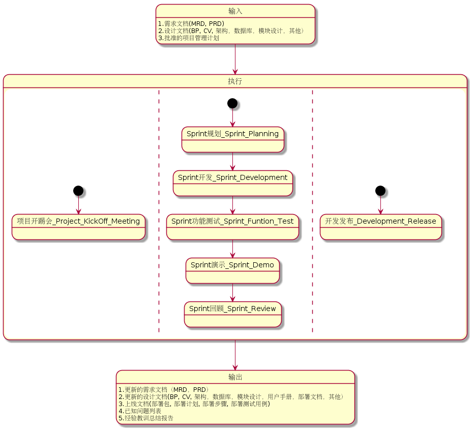
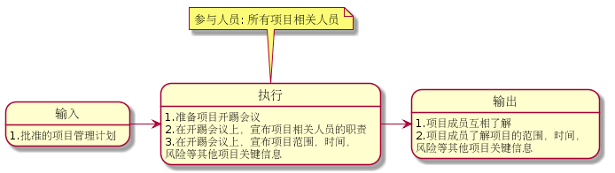
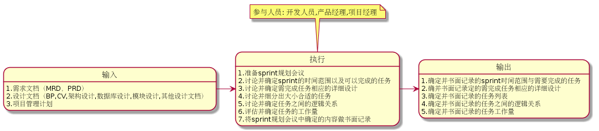
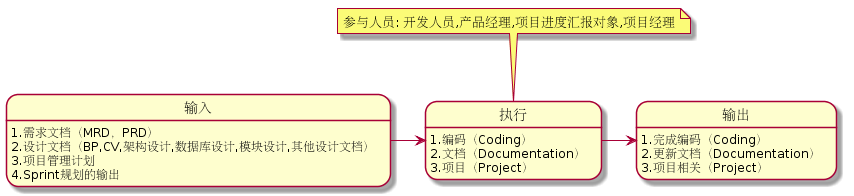
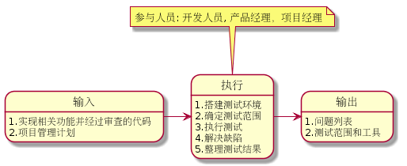
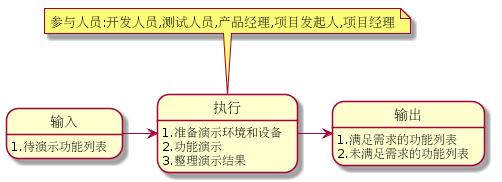
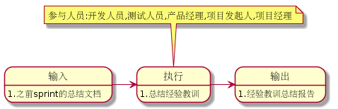
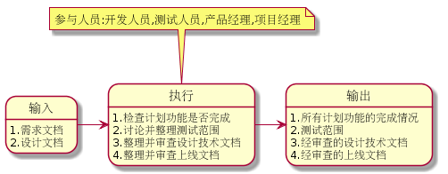

.. 以两个点开始的内容是注释。不会出现编写的文档中。但是能体现文档书写者的思路。
.. 一般一个文件，内容，逻辑的分层，分到三级就可以， 最多四级. 也就是
   H1. ########
   H2, ********
   H3, ========
   H4. --------

开发阶段
###################################################

开发阶段根据输入的需求和设计方案，对软件系统新功能进行编码和实现，并由开发人员进行功能测试，最终交付高质量可测试的软件包和设计文档

开发流程图
********

输入
========

1. 需求文档

  * MRD, 市场需求文档，对产品中规划的某个产品进行市场层面的说明。开发过程中如果需要了解产品的市场背景，可参考该文档
  * PRD, 产品需求文档，把MRD中的内容技术化，向研发部门说明产品的功能和性能指标。开发过程中涉及产品功能和性能指标，可参考该文档

2. 设计文档

  * Blue print, 交换设计文档，主要包括界面交互流程，每个界面的元素设计等等。开发过程中涉及界面交互流程及界面设计，看参考该文档
  * Core visual, 根据Blueprint Design文档，对实际视觉效果的进一步设计。开发过程中涉及实际视觉效果设计，可参考该文档

  * 架构设计文档, 为实现特定的产品功能而进行的软件架构设计文档，对开发过程中的架构设计具有重要的指导意义
  * 数据库设计文档, 为实现特定的产品功能而进行的数据库设计文档，开发过程中的数据库设计部分需要参考和更新该文档
  * 模块设计文档, 针对架构设计中的某个模块进行的详细设计文档，开发过程中涉及该模块部分需要参考和更新该文档
  * 其他设计文档, 根据实际项目需要，可能还有其他相关的设计文档

3. 批准的项目管理计划

  * 经过相关负责人批准的项目管理计划，其中定义项目中一些重要的因素，例如：范围，进度，人员安排，风险等
  * 开发过程需按照项目管理计划进行，例如开发进度，沟通等
  * 开发过程中需对项目管理计划中的风险进行跟踪

执行
========
1. 项目开踢会（Project kick off meeting）

  * 在项目管理计划完成并获得相关负责人批准后，召集项目所有相关人员，对项目的范围，进度，人员安排，风险等进行阐述

2. Sprint规划（Sprint planning）

  * 规划sprint的时间和在该时间范围内能完成的任务。讨论并确定开发任务对应的的详细设计，并将所有的任务细分成粒度合适的子任务，最后对子任务的工作量进行估算

3. Sprint开发（Sprint development）

  * 按照设计和规划的任务，将计划需完成的功能进行编码实现，并更新相关文档

4. Sprint功能测试（Sprint function test）

 * 对sprint完成的功能进行开发测试，保证没有重大缺陷

5. Srpint演示（Sprint demo）

  * 邀请相关人员，对完成的功能进行演示，并获取反馈

6. Sprint回顾（Sprint review）

  * 对sprint中的经验教训进行总结并形成文档，在后续的sprint中进行提高
..
 缺陷解决（Bug fix）（需讨论问题：这个可以考虑合并到sprint development里边，不需要单独的bug fix）

7. 项目发布（Project release）（需讨论问题：建议改名为“开发发布”Development release， 项目发布太大了）

  * 对开发过程中的各种成果，包括代码，文档和测试进行整理和总结，形成并发布正式的技术文档，上线文档和测试范围

参与人员
========
1. 所有项目相关人员

输出
========

1. 需求文档

  * 更新的MRD
  * 更新的PRD

2. 设计及技术文档

  * 更新的Blue print
  * 更新的Core visual
  * 更新的架构设计文档
  * 更新的模块设计文档
  * 更新的数据库设计文档
  * 更新的用户手册
  * 更新的部署文档
  * 其他文档

3. 上线文档

  * 部署包（Deploy packages）
  * 部署计划（Deploy plan）
  * 部署步骤（Deploy steps）
  * 部署测试用例（Deploy test case）

4. 已知问题列表

  * 开发过程中遗留下来的已经问题，需要在后面的阶段进行解决的问题

5. 经验教训总结报告

  * 开发过程中对经验教训进行总结并形成的文档，对以后的项目具有借鉴意义

项目开踢会(Kick Off Meeting)
********
在项目管理计划完成并获得相关负责人批准后，召集项目所有相关人员，对项目的范围，进度，人员安排，风险等进行阐述

输入
========
1. 批准的项目管理计划

  * 在项目开踢会对项目管理计划中的相关内容进行阐述

执行
========
1. 准备项目开踢会议

  * 确保项目管理计划得到相关负责人的批准
  * 邀请所有项目相关人员参加项目开踢会

2. 在开踢会议上，宣布项目范围，时间，风险等其他项目关键信息
   确保所有项目人员了解项目范围，时间，风险等关键信息

3. 在开踢会议上，宣布项目相关人员的职责
   确保所有项目人员了解各自的角色和责任，并对项目其他成员的角色和责任有明确的了解

参与人员
========
1. 所有项目相关人员

输出
========
1. 项目成员互相了解
2. 项目成员了解项目的范围，时间，风险等其他项目关键信息

最佳实践
========
1. 项目开踢会前，项目经理需要将项目的重要信息（如范围，计划和人员安排等）收集并整理好，并且需要保证项目主要范围，里程碑计划和重要的人员安排都经过项目重要干系人（例如部门经理和产品经理）的同意
2. 项目开踢会通常在项目的范围，计划，人员安排等重要的因素确定并批准后，召集项目所有人员，举行开踢会议。开踢会议之后，按照计划正式开始进行设计和开发工作
3. 项目开踢会最重要的目的是让项目相关的所有人员了解项目的范围，计划和人员安排。还可以在会议上面指出一些会迫切需要解决的问题，并明确问题的所有人，这样问题会被重视并很快被解决
4. 项目开踢会还可以明确项目团队必要的规则。例如开会的规则：开会前组织者和参与着都要做好准备，开会着重解决问题，开完会发会议记录并制定行动要点（action point）

Sprint规划(Planning)
********
规划sprint的时间和在该时间范围内能完成的任务。讨论并确定开发任务对应的的详细设计，并将所有的任务细分成粒度合适的子任务，最后对子任务的工作量进行估算

输入
========
1. 需求文档（MRD，PRD）

  * 规划过程遇到需求相关的问题，可以参考需求文档

2. 设计文档（Blue print，Core visual, 架构设计文档，数据库设计文档，模块设计文档，其他设计文档）

  * 在讨论详细设计时需参考设计文档

3 项目管理计划

  * 在讨论和确定sprint的时间和可以完成的任务时需参考项目管理计划中的详细计划

执行
========
1. 准备sprint规划会议
2. 在sprint规划会议上，讨论并确定sprint的时间范围以及可以完成的任务
3. 在sprint规划会议上，讨论并确定需完成任务相应的详细设计
4. 在sprint规划会议上，讨论并细分出大小合适的任务
5. 在sprint规划会议上，讨论并确定任务之间的逻辑关系
6. 在sprint规划会议上，评估并确定任务的工作量
7. 将sprint规划会议中确定的内容做书面记录

参与人员
========
1. 开发人员，参与整个规划过程，包括sprint时间范围，可完成任务，详细设计，任务细分，逻辑及工作量的讨论和确定
2. 产品经理，规划过程中如果涉及需求文档无法解决的问题，需产品经理参与讨论
3. 项目经理，组织规划会议，控制会议流程和进度

输出
========
1. 确定并书面记录的sprint时间范围与需要完成的任务
2. 确定并书面记录的需完成任务相应的详细设计
3. 确定并书面记录的任务列表
4. 确定并书面记录的任务之间的逻辑关系
5. 确定并书面记录的任务工作量

最佳实践
========
1. Sprint规划会议的效果直接决定了该sprint的最终效果，规划会议完成前最后不要开始sprint中的任务
2. Sprint规划会议需要架构师，开发人员，项目经理和产品经理参加。如果产品经理不能参加，需要提前与产品经理确定功能的优先级
3. 通常在sprint规划会之前，需要确定该sprint所涉及的架构设计和关键技术点的设计
4. 通常在sprint规划会议上，需要对架构设计和关键技术点设计达成一致。如果无法达成一致，需创建相关任务，在sprint里边继续调研并达成一致
5. 在细分任务的时候，通常需要按照某种特定的逻辑进行，比如按照软件架构的层次分解一个每个故事，这样避免遗漏
6. 每个单独的任务的工作量最好控制在4-16小时之间，如果太大需要继续细分
7. 细分任务的时候不光需要考虑编码的工作，还要考虑代码审查，调试等其他工作
8. 估算任务的工作量是让大家以时间为单位估算工作量，而不是完成这个任务需要多少时间。比如1000米赛跑，是估算是1000米还是500米，而不是跑1000米需要多长时间
9. 估算任务的工作量通常采用Scrum Poker方法，避免大家的估算相互影响。如果有开发人员对某个任务不熟悉，可以不参与该任务的估算
10. 细分的任务以及任务的逻辑关系和工作量，需要以书面的形式记录下来，以免会后有错误或者遗漏
11. 对每个任务的描述尽量详细，尽可能的将相关信息记录下来，并且明确任务完成的标准

Sprint开发(Development)
********
按照设计和规划的任务，将计划需完成的功能进行编码实现，并更新相关文档

输入
========
1. 需求文档（MRD，PRD）

  * 开发过程中遇到需求相关的问题，可以参考需求文档
  * 实际的实现与原来的需求不符或者原需求没有规定相关内容，需与产品经理讨论并同意后更新需求文档

2. 设计文档（Blue print，Core visual, 架构设计文档，数据库设计文档，模块设计文档，其他设计文档）
   
  * 开发过程中需要参考相关的设计文档进行开发，不断的提高和改正之前的设计，并更新相关设计文档

3. 项目管理计划

  * 开发过程中需按照之前制定并批准的项目计划进行
  * 对项目管理计划中的相关风险进行跟踪，确保项目顺利进行
  * 按照项目管理计划中的沟通计划进行项目沟通，如项目进度汇报等

4. Sprint规划的输出

  * 确定的sprint时间范围与需要完成的任务
  * 确定的需完成任务相应的详细设计
  * 确定的任务列表
  * 确定的任务之间的逻辑关系
  * 确定的任务工作量

执行
========
1. 编码（Coding）

  * 根据sprint规划确定的任务进行开发，并遵守接口先行原则
  * 对开发的功能进行开发测试并修正缺陷，保证无重大缺陷存在，级别较低不影响测试的缺陷可以记录到问题列表以待合适时间再解决
  * 代码审查（code review），确保代码符合编码规范，确保符合确定的设计思路，确保功能是以最优的方式实现

2. 文档更新（Documentation）

  * 更新需求文档（MRD，PRD），需求问题与产品经理讨论并同意后更新需求文档
  * 更新架构设计文档， 不断的提高和改正之前的架构设计，并更新文档
  * 更新数据库设计文档，不断的提高和改正并细化之前的数据库设计，并更新文档
  * 更新模块设计文档，不断的提高和改正并细化之前的模块设计，并更新文档
  * 更新其他相关设计文档，不断的提高和改正并细化之前的其他相关设计，并更新文档

3. 项目（Project）

  * 每天的同步会（Daily sync meeting），确保项目成员清楚其他人员的任务和进度，确保问题得到及时解决
  * 控制开发的进度，如果实际开发进度偏离计划，需与项目相关人员讨论并解决问题
  * 进度汇报（Progress report），以各种形式（包括正式的，非正式的）将项目的总的进度，完成的主要任务，接下来要完成的任务，进度预测以及风险情况等项目重要信息汇报给项目相关人员

参与人员
========
1. 开发人员，参与编码和文档更新工作
2. 产品经理，开发过程中如果涉及需求文档无法解决的问题，需产品经理参与讨论
3. 项目进度汇报对象，根据项目管理计划中的沟通计划，将项目的进度情况及时的汇报给项目相关人员
4. 项目经理，控制开发的进度，发现并组织问题讨论，组织同步会，发布进度报告以及其他项目相关工作

输出
========
1. 完成编码（Coding）

  * 实现计划需要完成的功能，并且经过开发测试，没有重大缺陷
  * 代码满足代码规范并通过代码审查

2. 更新文档（Documentation）

  * 更新的需求文档（MRD，PRD）
  * 更新的架构设计文档，数据库设计文档，模块设计文档，以及其他相关设计文档

3. 项目相关（Project）

  * 计划完成功能完成情况
  * 进度报告，使项目相关人员清楚的了解项目的进度情况

最佳实践
========
1. 通常按照故事的优先级，先集中完成优先级高的故事，然后再开始优先级相对低的故事
2. 每天同步会必须按时进行，该会议主要同步任务的状态，不是技术等细节问题的讨论会，也不是项目经理来检查大家的工作是不是饱满
3. 每天同步会最长不要超过15分钟，大家轮流说三个问题“1.昨天主要做了什么 2.今天主要做什么 3.有什么问题”。对细节问题不做讨论
4. 每天同步会不仅要说出自己的状态和问题，同时还要关注其他人的状态和问题
5. 发现阻碍任务进度的问题一定要及时提出，不要自己花太长的时间去研究，第一时间找到相关人寻求帮助
6. 同一时间尽量工作在单个任务上面
7. 燃尽图如果7个点都在理想线的同一侧，表明项目失控，需要立即采取措施（加班，增加人员或者减少范围等）
8. 如果是服务器端的开发，并且新增或者修改的公开接口比较多，需要考虑客户端的情况，对这些接口的部署做出计划，并告知客户端
9. 如果是服务器端的开发，需要先完成公开接口的工作，如果接口的实现需要很长时间，可以考虑部署假数据以供客户端调试
10. 如果发现需求文档有问题，不要盲目进行开发。应立刻找到相关负责人，如项目经理，产品经理等，要求澄清需求并更新需求文档

Sprint功能测试(Function Test)
********
对sprint完成的功能进行开发测试，保证没有重大缺陷

输入
========
1. 实现相关功能并经过审查的代码

  * 通过代码生成部署包

2. 项目管理计划

  * 按项目管理计划监控功能测试进度，并跟踪相关风险

执行
========
1. 搭建测试环境

 * 将代码编译生成部署包并部署到测试环境
 * 部署人员需验证测试环境符合测试要求

2. 确定测试范围和测试工具
  * 根据修改的代码情况讨论并确定开发测试的范围和后续测试人员的测试范围，并做书面记录
  * 确定需要准备的测试工具，如客户端应用程序等

3. 执行测试

  * 根据测试范围，执行测试

4. 解决缺陷

  * 遇到技术问题及时与相关技术人员讨论并解决
  * 遇到需求文档无法解决的问题及时与产品经理讨论并解决
  * 确保无重大缺陷阻碍后续测试人员的测试

5. 整理测试结果

  * 整理出已解决问题列表和待解决问题列表

参与人员
========
1. 开发人员，搭建测试环境，执行测试，解决测试过程中遇到的问题，及时解决缺陷
2. 产品经理，讨论需求文档无法解决的需求问题，并更新需求文档
3. 项目经理，监控测试进度，根据测试进度和结果采取相应的措施

输出
========
1. 问题列表

  * 包括已解决问题列表和待解决问题列表，待解决问题列表

2. 测试范围和工具

  * 书面记录的测试范围，包括开发测试范围和后续测试人员测试范围，以及测试必要的工具

最佳实践
========
1. 尽量多的发现问题，但是只解决重大问题
2. 对关键问题，一定要先讨论清楚解决方案，然后再继续进行，避免返工
3. 发现的问题需要做详细的书面记录，避免歧义
4. 最好能为新功能添加自动化测试用例，这样可以提高测试效率，方便以后的维护工作

Srpint演示(Demo)
********
邀请相关人员，对完成的功能进行演示，并获取反馈

输入
========
1. 待演示功能列表

  * 已实现且经过测试的功能列表
  * 无重大缺陷，具备演示条件

执行
========
1. 准备演示环境和设备

  * 准备演示环境和相关的设备，如适当型号的手机，可以用作演示的应用程序等
  * 确保演示过程不会受环境和设备的影响

2. 功能演示

  * 演示相关功能
  * 讨论功能是否满足需求，如不满足需求，需进一步明确需求

3. 整理演示结果

  * 将演示过程中发现的问题整理并记录下来，待后续阶段解决

参与人员
========
1. 开发人员，准备演示环境和设备，进行功能演示
2. 测试人员，准备演示环境和设备，进行功能演示
3. 产品经理，参与功能演示，对演示的功能提出相关反馈
4. 项目发起人，参与功能演示，对演示的功能提出相关反馈
5. 项目经理, 邀请相关人员参与演示，控制演示过程和进度，整理并记录相关问题

输出
========
1. 满足需求的功能列表

  * 经产品经理确认的满足需求的功能列表

2. 未满足需求的功能列表

  * 经产品经理确认的未满足需求的功能列表

最佳实践
========
1. 所有重要干系人最好都能参加演示会，这样大部分不同意见在会议上就可以直接讨论解决
2. 组织会议者必须准备好演示的范围，环境及设备等，但不需要花费太多时间和精力进行过度的准备
3. 在演示过程中也需按照功能的优先级进行
4. 对于比较大的功能，可以将演示会分为多个进行。这样，有进展就可以进行小规模的演示，以便最快的得到重要干系人的意见并进行相应的调整

Sprint回顾(Review)
********
对sprint中的经验教训进行总结并形成文档，在后续的sprint中改进提高

输入
========
1. 之前sprint的总结文档

  * 需要检查之前sprint总结的经验和教训在本sprint里边的执行情况

执行
========
1. 总结经验教训

  * 对sprint过程中的经验教训进行总结，并讨论提高的解决方法
  * 将讨论的经验教训和解决方法进行整理，形成书面的记录

参与人员
========
1. 开发人员，讨论经验教训和解决方法
2. 测试人员，讨论经验教训和解决方法
3. 项目发起人，讨论经验教训和解决方法
4. 产品经理，讨论经验教训和解决方法
5. 项目经理，讨论经验教训和解决方法

输出
========
1. 经验教训总结报告

  * 形成正式的报告并归档，对后续的sprint和团队流程的提高有帮助

最佳实践
========
1. Sprint回顾是必须的，通过它可以发现团队存在的问题，不断提高团队的开发能力和工作效率
2. Sprint回顾通常通过开会讨论的形式进行
3. 大家最好在开会前准备好自己的总结，如果没有，也可以在会议中花几分钟让大家写下来，然后开始讨论
4. 如果有问题是可以很快解决的，可以作为行动要点（action point），并分配到责任人，明确完成期限
5. 如果有问题是由于时间或者技术等原因目前无法解决的，可以单独记录下来，以后在合适的时机再解决
6. 下个sprint会议开始时需要先逐条检查上一个sprint行动要点的执行情况

开发发布(Development Release)
********
对开发过程中的各种成果，包括代码，文档和测试进行整理和总结，形成并发布正式的技术文档，上线文档和测试范围

输入
========
1. 需求文档

  * 包括MRD和PRD
  * 用来检查计划完成的功能是否完成

2. 设计文档

  * 包括Blue print，Core visual, 架构设计文档，数据库设计文档，模块设计文档及其他技术文档
  * 设计文档需要在此阶段进行进一步完善并审查

执行
========
1. 检查计划功能是否完成

  * 对照需求文档，检查计划完成功能是否完成
  * 整理遗留问题列表

2. 讨论并整理测试范围

  * 根据代码修改情况，讨论测试范围，并形成书面记录

3. 整理并审查设计技术文档

  * 整理并审查架构设计文档
  * 整理并审查模块设计文档
  * 整理并审查数据库设计文档
  * 整理并审查用户手册
  * 整理并审查部署文档
  * 整理并审查其他技术文档

4. 整理并审查上线文档

  * 整理并审查部署包（Deploy packages）
  * 整理并审查部署计划（Deploy plan），包括release notes
  * 整理并审查部署步骤（Deploy steps）
  * 整理并审查部署测试用例（Deploy test case）

参与人员
========
1. 开发人员, 检查功能完成情况，讨论测试范围，整理并审查设计技术文档，整理并审查上线文档
2. 测试人员，讨论测试范围
3. 产品经理, 验收技术文档和上线文档
4. 项目经理，控制整个过程按时完成，组织相关会议，确保相关文档质量

输出
========
1. 所有计划功能的完成情况

  * 完成情况将为测试选择测试用例提供参考

2. 测试范围

  * 测试范围将为测试选择测试用例提供参考

3. 经审查的设计技术文档

  * 架构设计文档
  * 模块设计文档
  * 数据库设计文档
  * 用户手册
  * 部署文档
  * 其他技术文档

4. 经审查的上线文档

  * 部署包（Deploy packages）
  * 部署计划（Deploy plan）,包括release notes
  * 部署步骤（Deploy steps）
  * 部署测试用例（Deploy test case）

最佳实践
========
1. 文档的生成尽量使用Sphinx，这样可以多人协作完成同一个文档
2. 部署包和部署步骤等尽量自动化生成
3. 所有文档必须先通过内部审查，然后再对外发布
