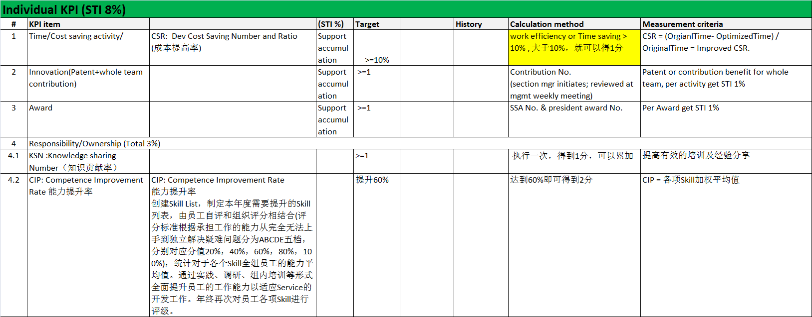

KPI 介绍
###################################################

Individual Objectives KPI的分解
************************************************

2013年度，公司的KPI体系共分为三部分

#. 50%. Company Common Scorecard, （整个公司层面）
#. 30%. Development Scorecard, （整个研发层面）
#. 20%. Individual Objectives,(整个部门层面）

关于Individual Objectives，我们部门把这个分为2个KPI: Team KPI& Individual KPI. 我们Section是这样定义我们的KPI的。

1. Team KPI

2. Individual KPI

   

   

Overview for Individual KPI
***************************************************

=============== ============= =============== ============= =============== ========================================
 Name               CSR            KSN          CIP          Innovation      Award/A&SD Improvement project
=============== ============= =============== ============= =============== ========================================
Fu, Jared
Chen,MIn
Ma, Maozeng
Teng,Tina
Jiao,Yan
Cheng, Chris
Qiao,Weiqing
Wei,Devin
Zhang,Bo
Hu,Jingzhi
Zheng,Lingbo
Fei,Xinsheng
Bao,Pierce
Cai,Tony
Zhao,Yi
=============== ============= =============== ============= =============== ========================================

