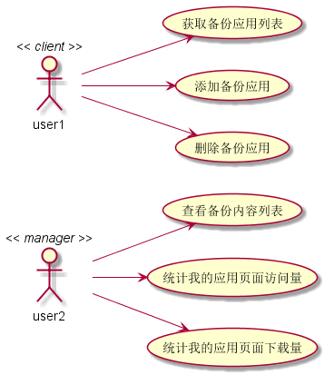
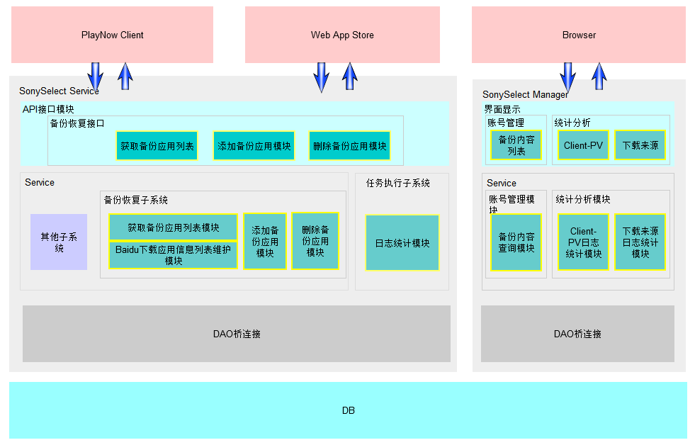
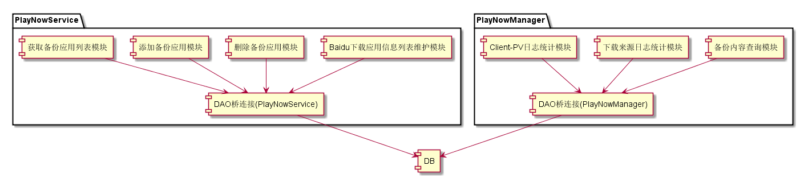

系统架构设计详解
#########################

架构设计策略
*********************
#. 核心架构技术
	* 整体架构采用MVC技术， 将UI展示与逻辑相分离。同时又在此基础之上将此模型层细分为BLL（业务逻辑层）与DAL（数据访问层）。
#. 重用设计
	* 使用原有设计接口，客户端可以不用修改
#. 维护性设计
	* 无

架构设计图解
*******************

用例视图
================== 

逻辑视图
==================

无

并发视图
==================

无

架构视图
================== 

模块关系图
==================

模块关系图描述系统的实现模块以及它们之间的依赖关系。本设计中主要修改的组件有：
	*  PlayNowManger，增加备份内容查询模块；修改日志统计模块，增加统计我的应用页面访问量和我的应用页面下载量。
	*  PlayNowService，增加获取备份应用列表模块、添加备份应用模块、删除备份应用模块和Baidu下载应用信息列表维护模块。
	*  DB，添加用户下载应用表PN_UserDownloadList和Baidu下载应用信息表PN_BaiduDownloadList。

配置视图
==================

无
