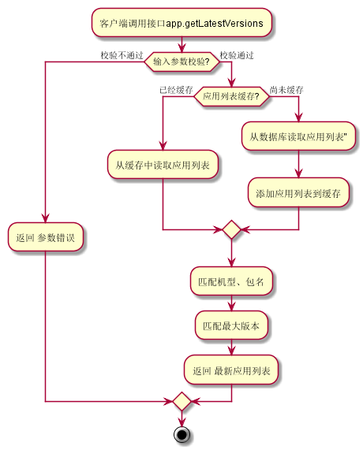
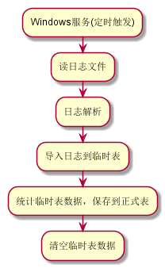
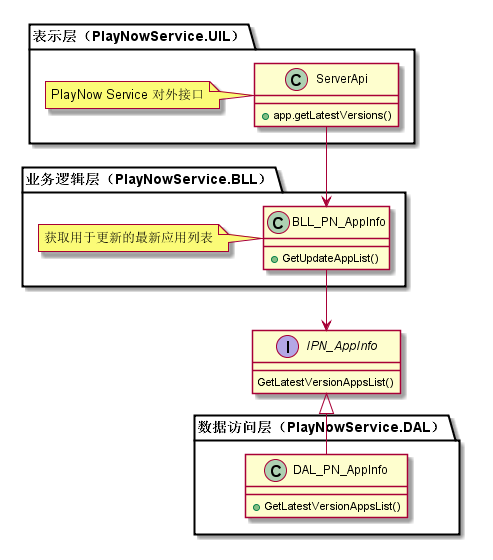
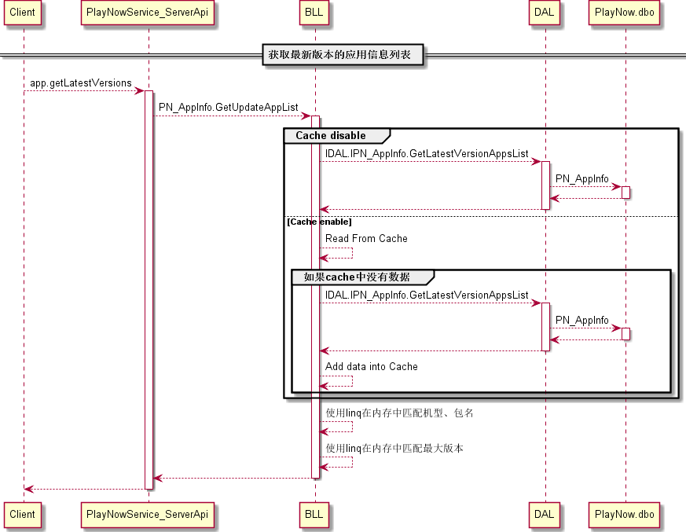

更新模块
#########################

说明
*******************
此模块主要实现对客户端的接口，支持用户获取最新版本的应用信息列表，另外还包括相关的日志统计部分修改。

业务流程图
*******************

* 获取最新版本的应用信息列表

* PlayNowService日志统计

详细设计图
*******************

* 获取最新版本的应用信息列表

时间顺序图
*******************

* 获取最新版本的应用信息列表

API接口 
*******************
对客户端接口：

+-------------------------+---------------------------------+------------------------------+
|接口名称                 |       参数                      |    接口功能                  |
+=========================+=================================+==============================+
|app.getLatestVersions    |PackageInfos                     |获取最新版本的应用信息列表    |
+-------------------------+---------------------------------+------------------------------+

容错处理
*******************
N/A

传输安全
*******************
N/A

性能实现机制
*******************
N/A

数据库关系
*******************
N/A

设计模式
*******************
N/A
