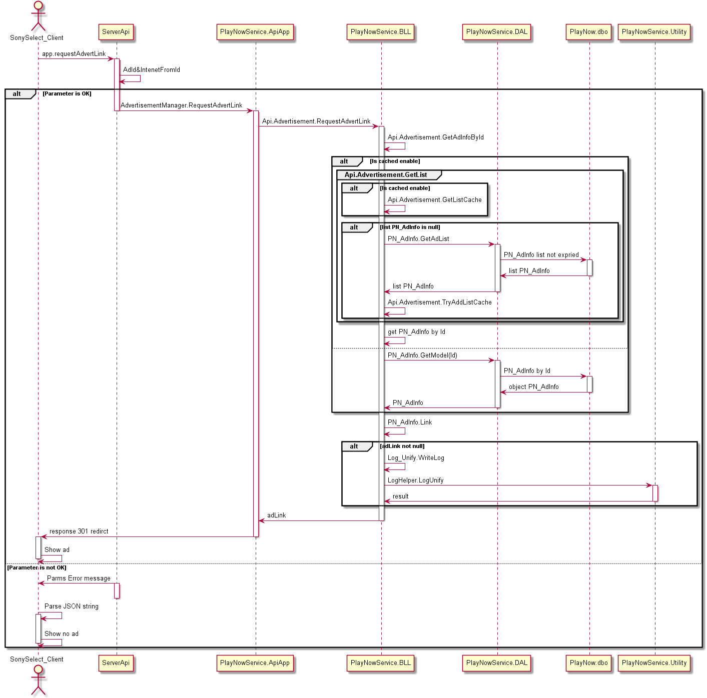

Widget模块
#########################

说明
*******************
此模块主要实现对客户端的接口，为Widget提供内容。

业务流程图
*******************
*  PlayNowService获取Widget内容
 .. image:: images/widget_contentlist_process.png
*  PlayNowService请求广告链接
 .. image:: images/widget_adLink_process.png

详细设计图
*******************
*  PlayNowService获取Widget内容
 .. image:: images/widget_api_classes.png
*  PlayNowManager管理Widget内容
 .. image:: images/widget_manager_classes.png

流程
*******************
*  PlayNowService获取Widget内容

*  PlayNowService请求广告链接

API接口
*******************
对客户端接口：

+----------------------+---------------------------------------------------------+---------------------------------------+
|接口名称              |                 参数                                    |    接口功能                           |
+======================+=========================================================+=======================================+
|widget.getContentList |machineType, startIndex, returnNum, ContentType, AppType |根据机型、内容和应用类型获取Widget列表 |
+----------------------+---------------------------------------------------------+---------------------------------------+
|app.requestAdvertLink |AdId, IntenetFromId                                      |请求广告链接                           |
+----------------------+---------------------------------------------------------+---------------------------------------+

容错处理
*******************
无

传输安全
*******************
无

性能实现机制
*******************
无

数据库关系
*******************

ContentType: 1, 应用; 2, 广告
当为应用时PN_Widget.Id -> PN_AppInfo.Id，当为广告时PN_Widget.Id -> PN_AdInfo.Id

设计模式
*******************
无
