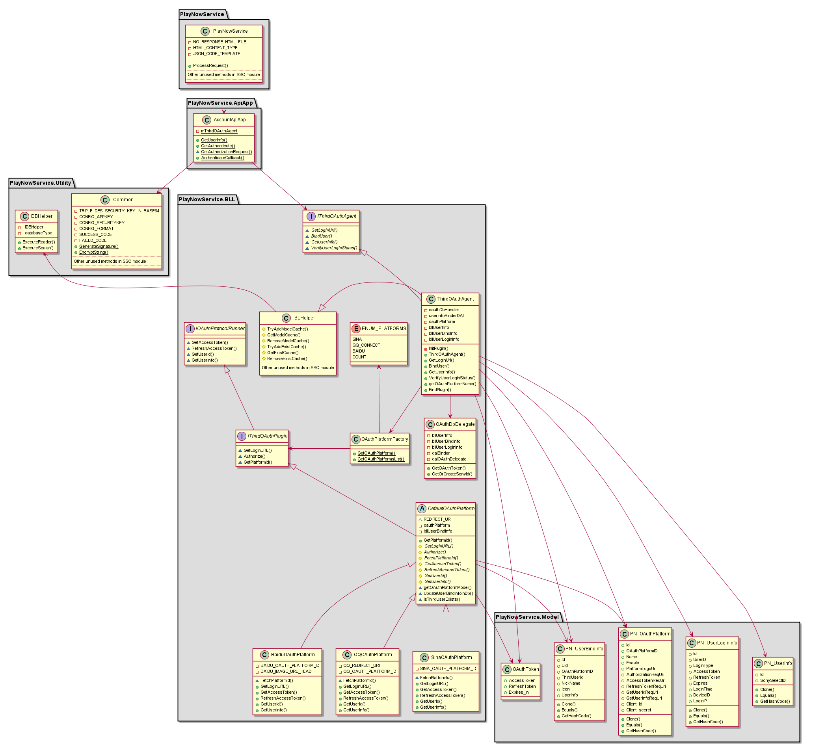
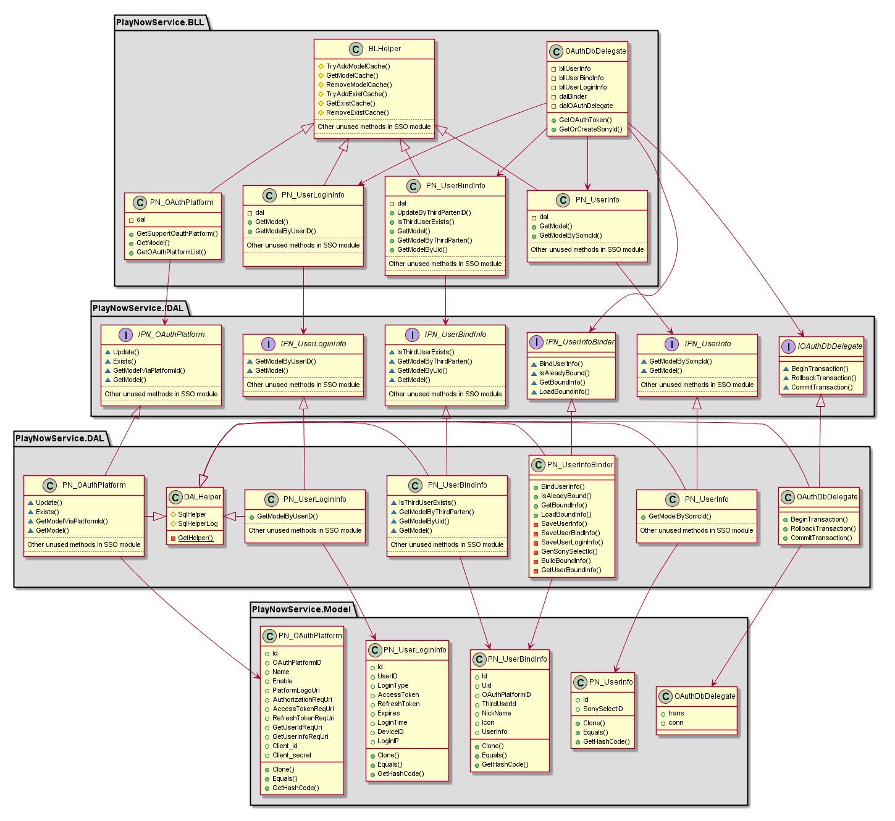
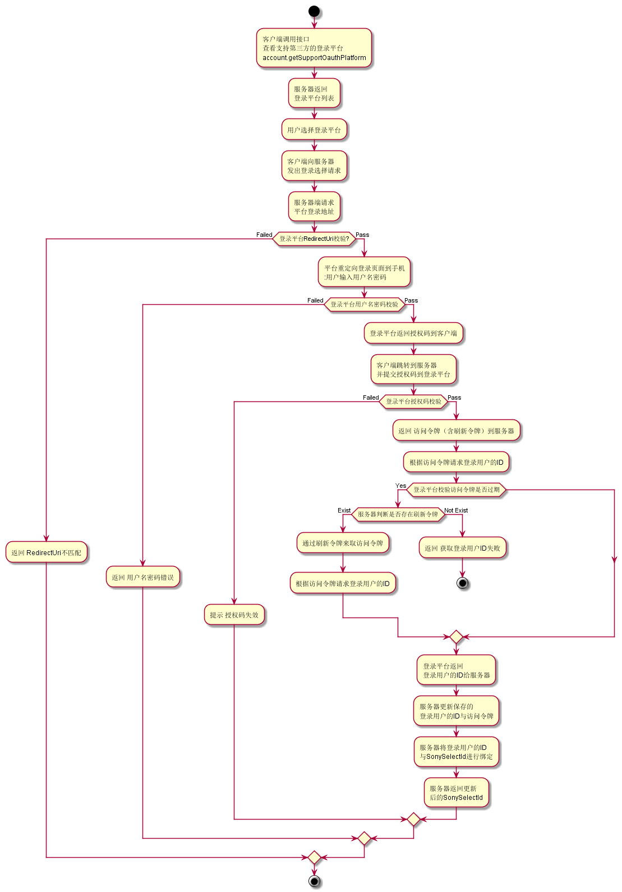
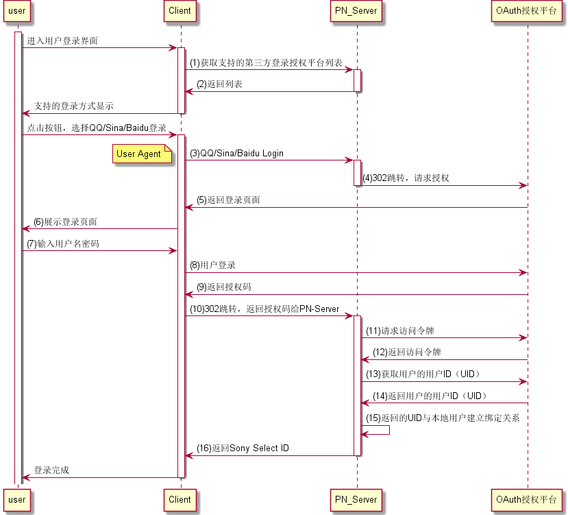
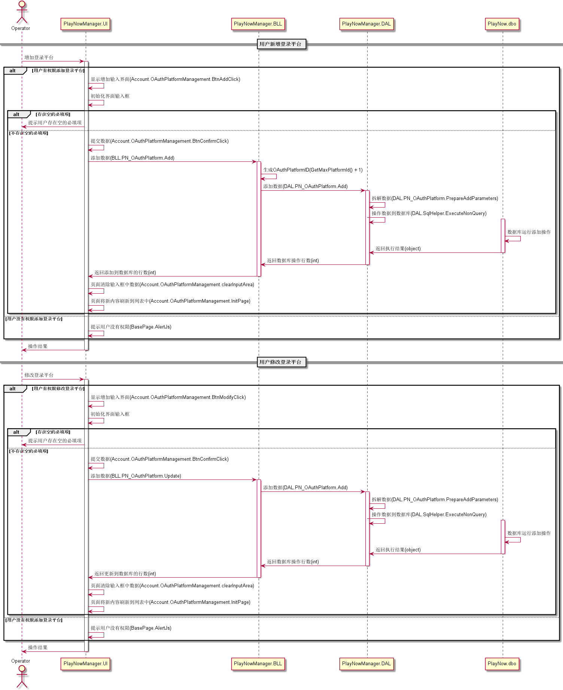
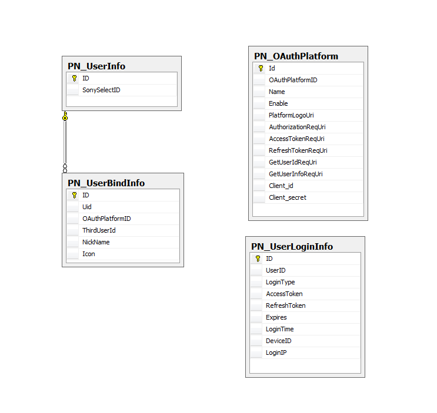

单点登录模块
#########################

说明
*******************
本模块支持用户通过Baidu、Sina Weibo账号来登录Sony Select平台，使得用户的第三方账号和SonySelect的用户信息可以绑定。

详细设计图
*******************

* 业务逻辑部分

* 数据访问部分

业务流程图
*******************

时间顺序图
*******************

* 用户登录处理时序图

* 后台管理时序图

API接口 
*******************
模块对客户端接口：

+--------------------------------+-----------------------------------------------+------------------------------------------------+
|接口名称                        |       参数                                    |    接口功能                                    |
+================================+===============================================+================================================+
|account.AuthenticateCallback    |code,context                                   |授权回调地址                                    |
+--------------------------------+-----------------------------------------------+------------------------------------------------+
|account.BindUserInfo            |OAuthPlatform, UserID, NickName, Expires       |绑定第三方用户信息接口 (Only For SSO Solution 1)|
+--------------------------------+-----------------------------------------------+------------------------------------------------+
|account.getSupportOauthPlatform |                                               |获取支持的登录方式                              |
+--------------------------------+-----------------------------------------------+------------------------------------------------+
|account.GetUserInfo             |SonySelectID,OAuthPlatformID                   |获取用户信息                                    |
+--------------------------------+-----------------------------------------------+------------------------------------------------+
|account.Authenticate            |SonySelectID,OAuthPlatformID                   |用户授权验证                                    |
+--------------------------------+-----------------------------------------------+------------------------------------------------+
|account.AuthorizationRequest    |OAuthPlatformID                                |请求第三方授权地址                              |
+--------------------------------+-----------------------------------------------+------------------------------------------------+

容错处理
*******************
无

传输安全
*******************
无

性能实现机制
*******************
无

数据库关系
*******************

设计模式
*******************
无
