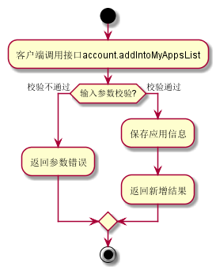
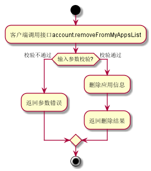
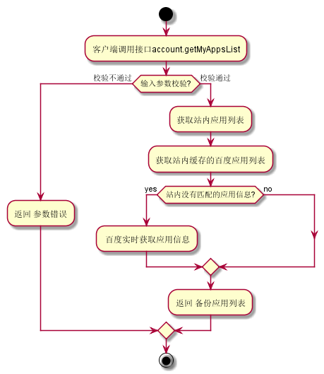
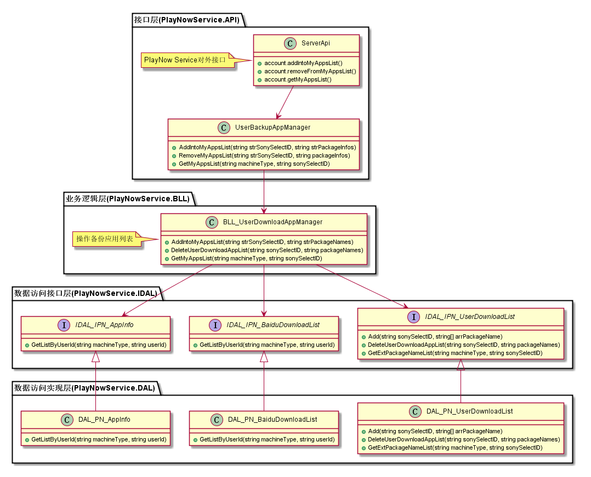
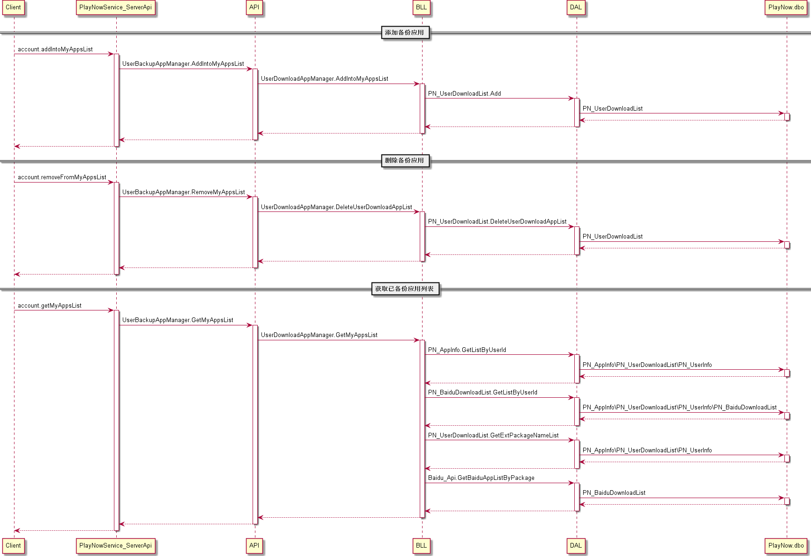
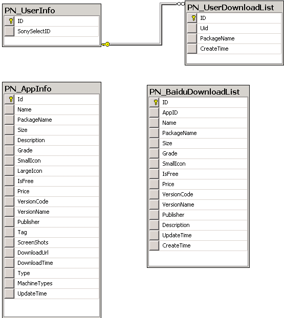

我的应用列表模块
#########################

说明
*******************
此模块主要实现客户端的接口，分为三部分：根据用户ID和应用包名列表添加备份应用、根据用户ID和应用包名列表删除备份应用、根据用户ID和机型获取备份应用列表。

活动图
*******************

详细设计图
*******************

流程
*******************

API接口 
*******************
对客户端接口

==============================  =============================  =======================================  
接口名称                        参数                           接口功能                                 
==============================  =============================  =======================================  
account.addIntoMyAppsList       SonySelectID、PackageInfos     根据用户ID和应用包名列表添加备份应用     
account.removeFromMyAppsList    SonySelectID、PackageInfos     根据用户ID和应用包名列表删除备份应用     
account.getMyAppsList           SonySelectID、MachineType      根据用户ID和机型获取备份应用列表         
==============================  =============================  =======================================

容错处理
*******************
无

传输安全
*******************
无

性能实现机制
*******************
无

数据库关系
*******************

设计模式
*******************
无
