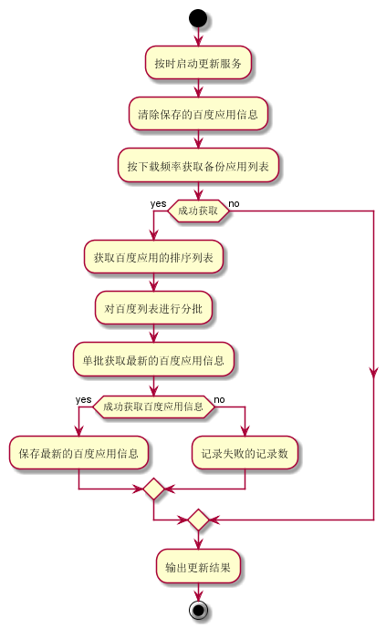
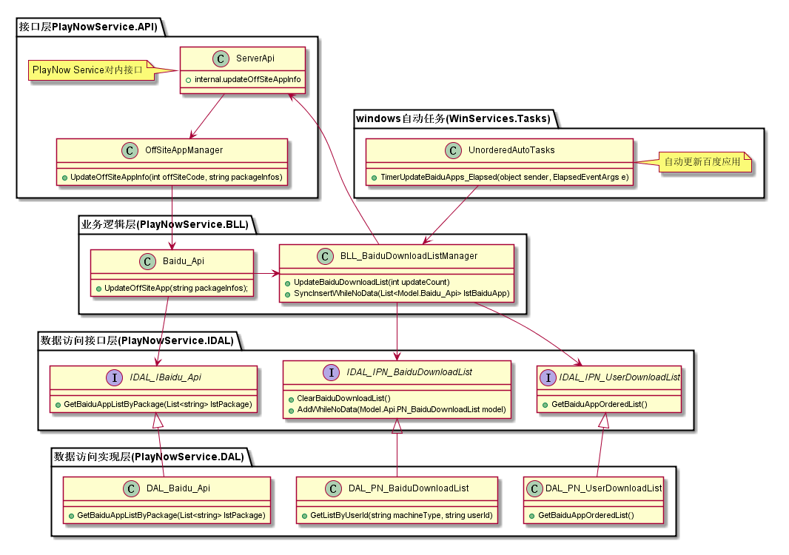
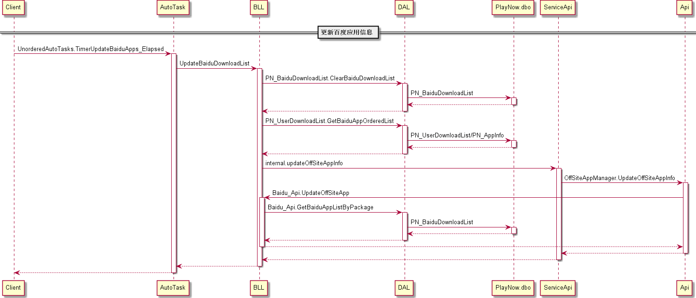
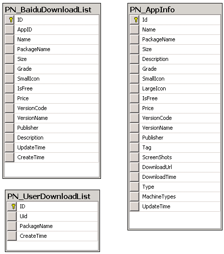

定时更新百度应用信息模块
#########################

说明
*******************
此模块用于定时更新百度应用信息，用于向终端用户提供较新版本的应用

活动图
*******************

详细设计图
*******************

时序图
*******************

API接口 
*******************
内部接口

+-------------------------------+---------------------------------+------------------------------------------------------+
|接口名称                 	 	|       参数                      |    接口功能                  					     |
+===============================+=================================+======================================================+
|internal.updateOffSiteAppInfo  |OffSiteCode、PackageInfos        |根据站外站点代码和应用包名更新应用信息   		     |
+-------------------------------+---------------------------------+------------------------------------------------------+

容错处理
*******************
无

传输安全
*******************
无

性能实现机制
*******************
无

数据库关系
*******************

设计模式
*******************
无
