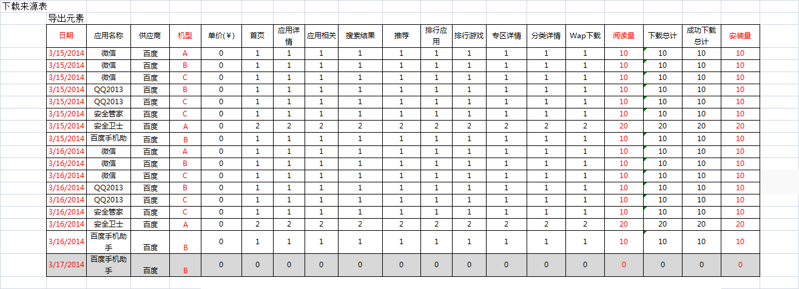

.. 1.0 documentation master file, created by
   sphinx-quickstart on Wed May 22 22:08:41 2013.
   You can adapt this file completely to your liking, but it should at least
   contain the root `toctree` directive.

CR00025 下载来源表实现按日期、应用、机型查看
====================================

**需求明细:**

#. 菜单位置：统计分析->下载来源表
#. 涉及调整：EXCEL导出
#. 导出显示所有产品：包括下载数据为0的产品
 * 导出应用无优先级排序
 * 导出供应商无优先级排序
#. 详细请看示意图辅助说明
   

  
.. toctree::
   :maxdepth: 3 
   :numbered:
   

  
  

