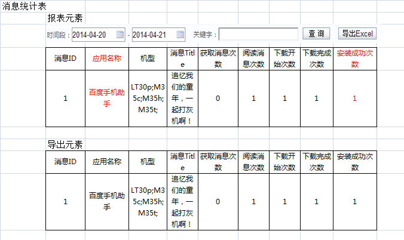

.. 1.0 documentation master file, created by
   sphinx-quickstart on Wed May 22 22:08:41 2013.
   You can adapt this file completely to your liking, but it should at least
   contain the root `toctree` directive.

CR00026 消息统计表新增应用名称、安装次数
====================================

**需求明细:**

#. 菜单位置：统计分析->消息统计表
#. 涉及调整：报表展现、EXCEL导出
#. 新增应用名称：Push对应的应用名称
#. 新增安装次数：此Push对应的用户安装成功次数
#. 详细请看示意图辅助说明

  
.. toctree::
   :maxdepth: 3 
   :numbered:
   

  
  

