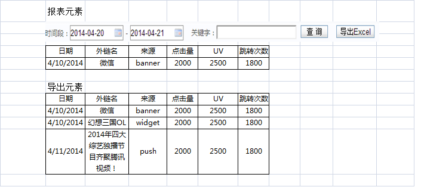

.. 1.0 documentation master file, created by
   sphinx-quickstart on Wed May 22 22:08:41 2013.
   You can adapt this file completely to your liking, but it should at least
   contain the root `toctree` directive.

CR00029 实现查看品牌外链点击量、UV及跳转成功次数
====================================

**需求明细:**

#. 新增数据表‘品牌外链数据’
#. 查询规则：分时间段查询
#. 列表元素：日期、外链名、来源、点击量、UV、跳转次数
  * 日期：精确到日
  * 外链名：品牌外链名称（消息标题）
  * 来源：注明来源于banner、widget及push
  * 点击量：点击品牌外链的次数
  * UV：访问品牌外链的独立用户数
  * 跳转次数：点击品牌外链并成功跳转到外部链接的次数
#.详情请见示意图辅助说明需求6

  
.. toctree::
   :maxdepth: 3 
   :numbered:
   

  
  

