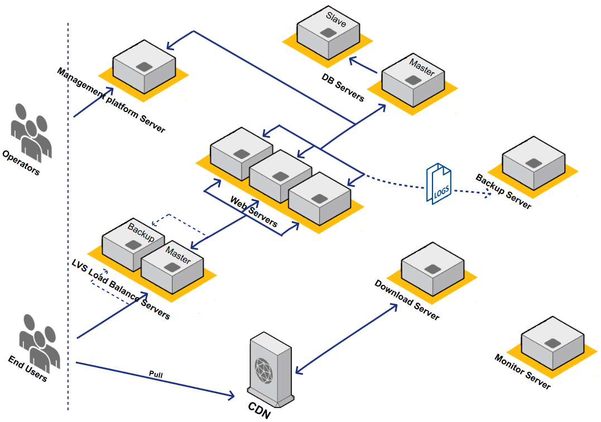
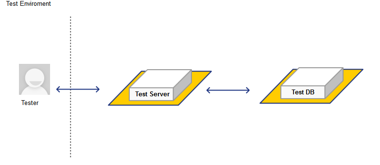
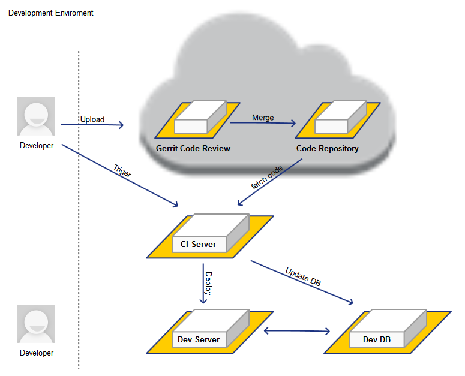

布署视图
########################################

线上环境布署视图
*********************

#. **名词解释**

            .. csv-table::
               :header: "", "名称", "描述"
               :widths: 1, 4, 5
            
               "1","**LVS Load Balance Servers**",         "LVS负载均衡服务器"
               "2","**Web Servers**",                      "Web服务器"           
               "3","**DB Servers**",                       "数据库服务器"
               "4","**Download Server**",                  "下载服务器"
               "5","**Management platform Server**",       "管理后台服务器"           
               "6","**Backup server**",                    "备份服务器"	
               "7","**Monitor server**",                   "监控服务器"	
               "8","**CDN**",                              "Content Delivery Network，即内容分发网络"	

#. **系统简介：**

	#. 运维人员通过管理后台来管理网站配置，如应用发布，消息推送等。发布应用时，应用会上传到下载服务器上。

	#. 终端用户访问索尼精选时，Http请求会经过LVS负载均衡服务器分发到Web服务器。

	#. 下载服务器中的内容会同步到CDN上，终端用户可以快速的下载。

	#. 备份服务器用于备份Web Servers生成的日志文件。

	#. 监控服务器与其他服务器在同一个网段内，用于监控局域网内所有服务器的状态。监控服务器没有对外的出口。

#. **线上环境访问地址：**    

	#. ServerApi地址：

           http://m.cn-playnow.com.cn/ServerApi.ashx

	#. WebAppStore地址：

           http://homepage.cn-playnow.com.cn/

           http://homepage.sonyselect.cn/

测试环境布署视图
*********************

#. **测试环境访问地址：**    

	#. ServerApi地址：

           http://stage.cn-playnow.com.cn/ServerApi.ashx

	#. WebAppStore地址：

           http://stage.cn-playnow.com.cn:16666/

	#. PlayNowManager地址：

           http://stage.cn-playnow.com.cn:16667/Login.aspx

开发环境布署视图
*********************

#. **开发环境访问地址：**    

	#. ServerApi地址：

           http://lab.cn-playnow.com.cn/the9service/ServerApi.ashx

	#. WebAppStore地址：

           http://lab.cn-playnow.com.cn/playnowservice/v5_4_130802/，其中v5_4_130802是版本号。

	#. PlayNowManager地址：

           http://lab.cn-playnow.com.cn/playnowmanager/Login.aspx

#. **CI Server地址：**    

           http://semcw21105:8080/job/CI/