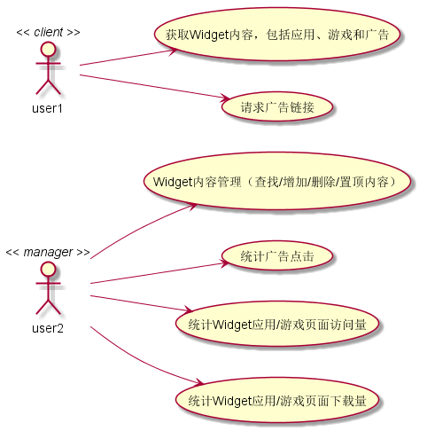
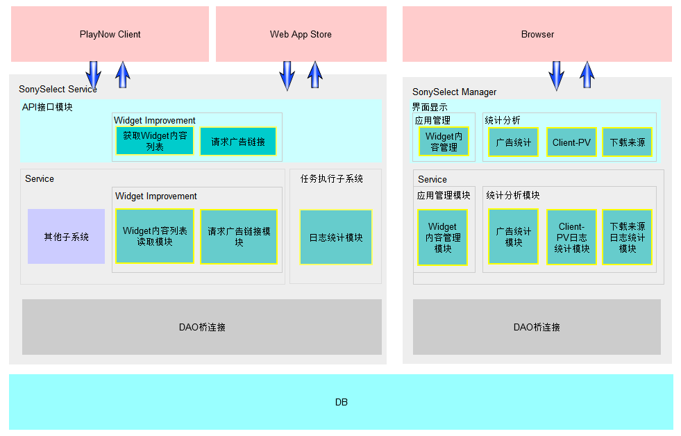
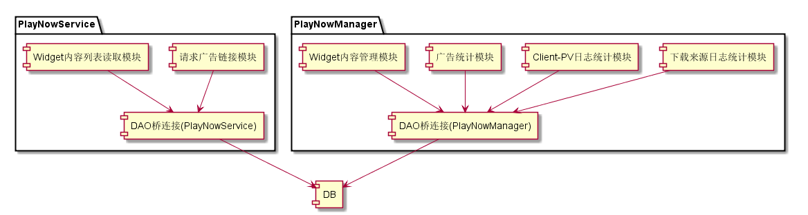

系统架构设计详解
#########################

架构设计策略
*********************
#. 核心架构技术
	* 整体架构采用MVC技术， 将UI展示与逻辑相分离。同时又在此基础之上将此模型层细分为BLL（业务逻辑层）与DAL（数据访问层）。
#. 重用设计
	* 使用原有设计接口，客户端可以不用修改
#. 维护性设计
	* 无

架构设计图解
*******************

用例视图
================== 

逻辑视图
==================

无

并发视图
==================

无

架构视图
================== 

模块关系图
==================

模块关系图描述系统的实现模块以及它们之间的依赖关系。本设计中主要修改的组件有：
	*  PlayNowManger，增加Widget内容管理模块；修改日志统计模块，增加统计Widget应用/游戏页面访问量和Widget应用/游戏下载量，增加广告统计。
	*  PlayNowService，增加Widget内容列表读取模块和请求广告链接模块，添加接口Widget.getContentList，修改接口log.addInfo，详细信息请参考接口文档。
	*  DB，添加Widget内容表（PN_WIDGET）；修改下载来源日志统计表PN_S_DownSource和PV日志统计表PN_S_ClinetPV，详细信息请参考数据库设计文档。

配置视图
==================

无
