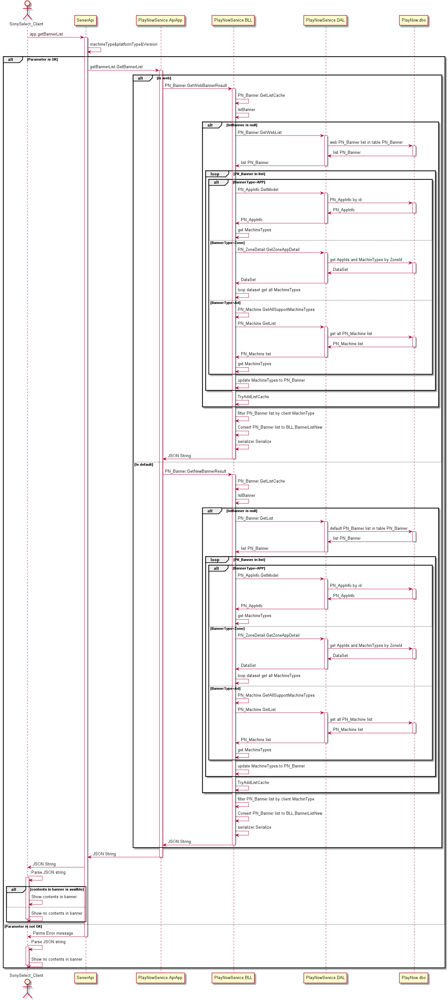
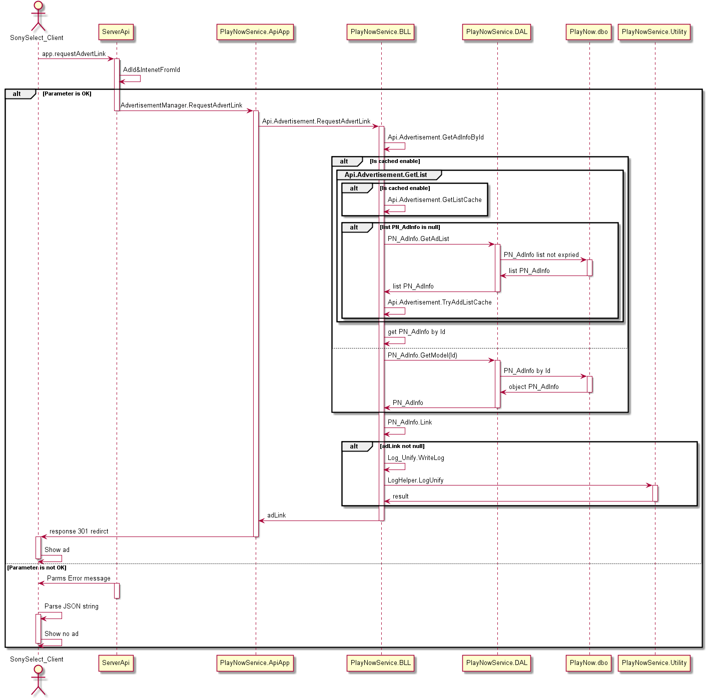
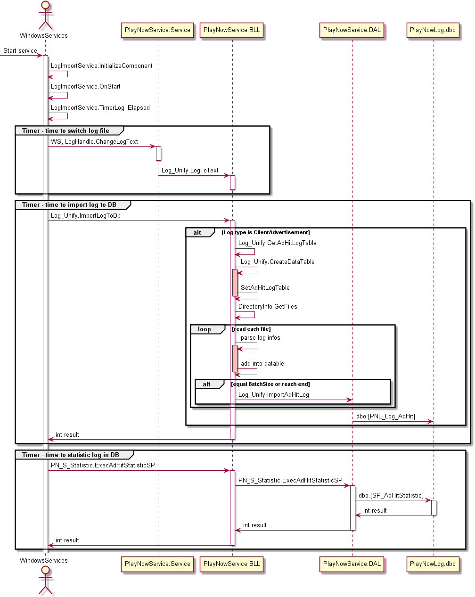
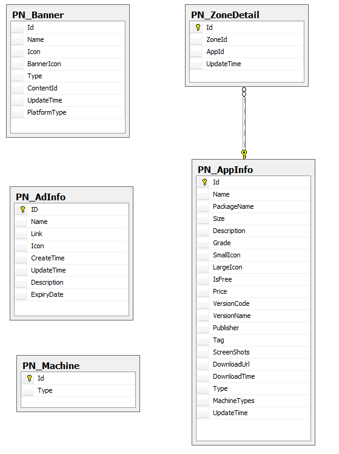

BannerAD模块
#########################

说明
*******************
此模块主要实现对客户端的接口，为Banner提供内容。

业务流程图
*******************
*  获取Banner内容
 .. image:: images/banner_contentlist_process.png
*  写广告点击日志
 .. image:: images/ad_witelog_process.png
*  广告日志统计
 .. image:: images/ad_stat_process.png

详细设计图
*******************
*  PlayNowService API
 .. image:: images/banner_api_classes.png
*  PlayNowWinService广告统计
 .. image:: images/ad_stat_classes.png
*  PlayNowManager广告内容管理
 .. image:: images/ad_manager_classes.png

流程
*******************
*  PlayNowService获取Banner内容

*  PlayNowService广告统计-获取广告链接并写日志

*  PlayNowService广告统计-日志导入及统计

API接口
*******************
对客户端接口：

+----------------------+---------------------------------------------------------+---------------------------------------+
|接口名称              |                 参数                                    |    接口功能                           |
+======================+=========================================================+=======================================+
|app.getBannerList     |machineType, platformType, Version                       |根据机型、平台类型和版本获取Banner列表 |
+----------------------+---------------------------------------------------------+---------------------------------------+
|app.requestAdvertLink |AdId, IntenetFromId                                      |请求广告链接                           |
+----------------------+---------------------------------------------------------+---------------------------------------+

容错处理
*******************
无

传输安全
*******************
无

性能实现机制
*******************
无

数据库关系
*******************

设计模式
*******************
无
