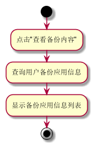
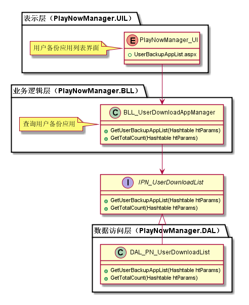
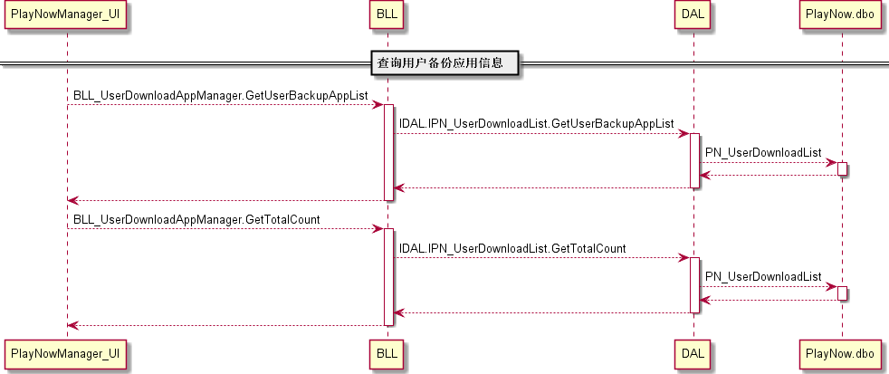
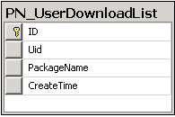

用户备份应用列表模块
#########################

说明
*******************
此模块主要向运营人员显示每个用户下的备份应用信息。

活动图
*******************

详细设计图
*******************

流程
*******************

API接口 
*******************

容错处理
*******************
无

传输安全
*******************
无

性能实现机制
*******************
无

数据库关系
*******************

设计模式
*******************
无
