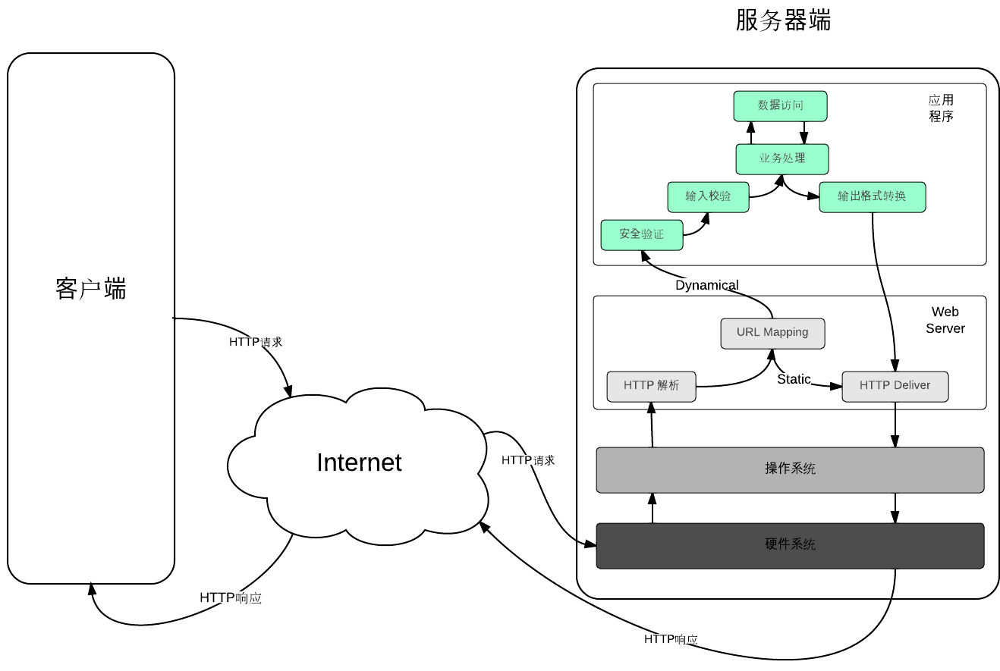
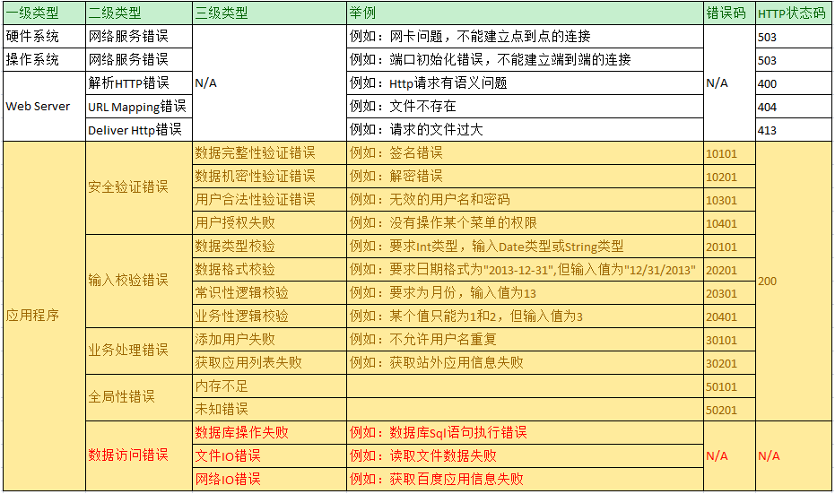

错误代码列表
########################################
* 正常请求的流程

  图中展示的是客户端发起请求，得到响应的一次正常的流程;
  
  图中的Static,表示客户端请求的静态资源,例如:index.html; Dynamical表示动态资源,例如:index.jsp
  
  下面主要讨论的是图中服务器端（绿色部分）出现错误或者异常时候的处理方式
  

* 错误代码列表
  
  数据访问错误不需要让客户端知道，需要转化为业务处理错误
			   

* 错误码规则
  
  #. 错误码由五位数字组成
  
  #. 从左到右，第一位表示二级类型，最多9类
  
  #. 第2、3位表示三级类型，最多99类
  
  #. 第4、5位表示具体错误，最多99个