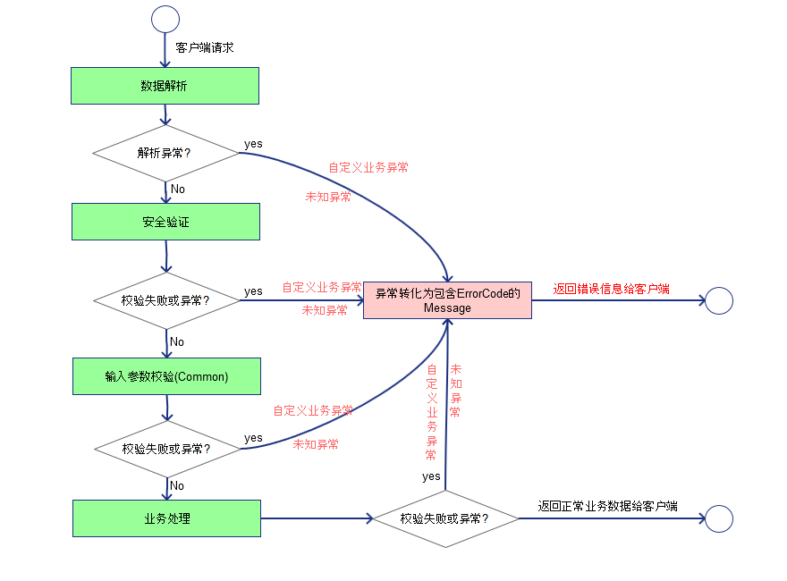
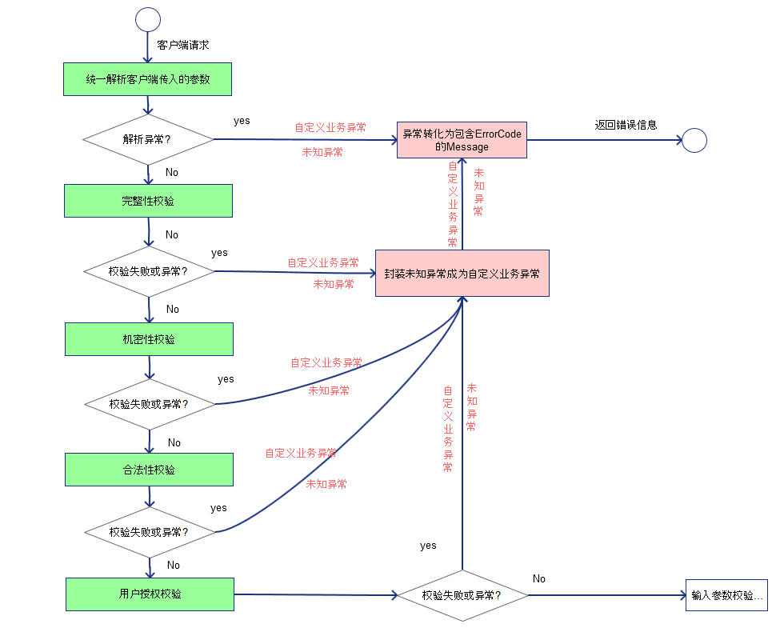
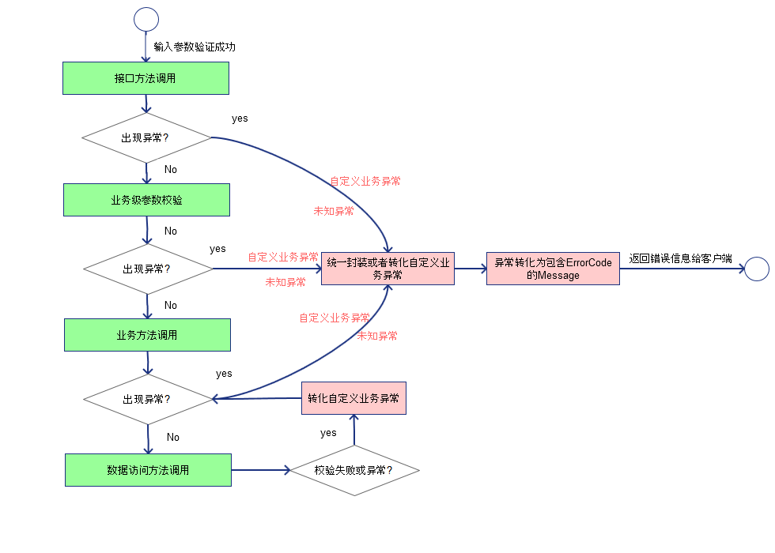
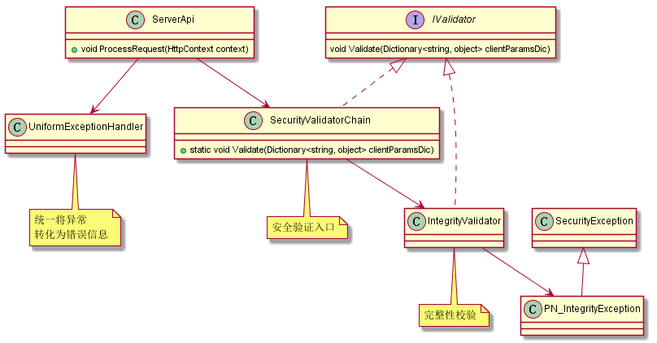
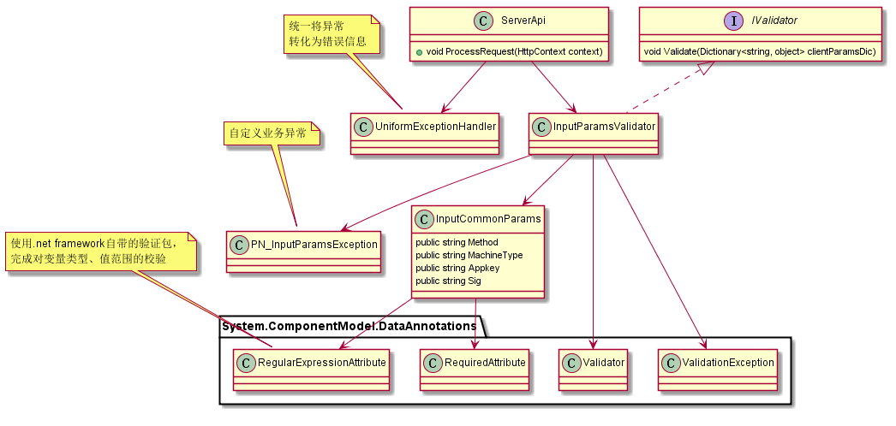
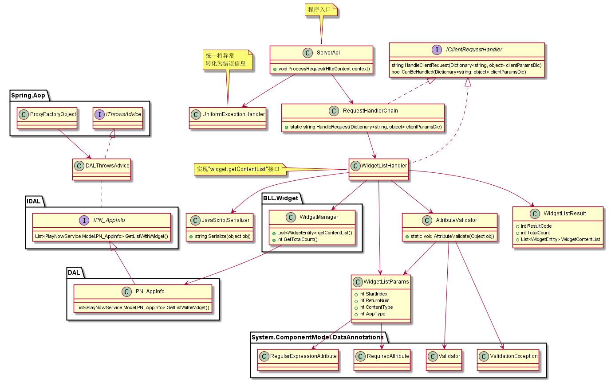

流程图
########################################

业务流程图
*****************
* 业务流程图（整体）

* 业务流程图（安全验证）

* 业务流程图（输入验证）

.. image:: _static/BFD_InputParams.png

* 业务流程图（业务处理）

详细设计图
*****************

* 类图（安全验证）

* 类图（输入验证）

* 类图（业务处理）

时间顺序图
*****************

* 时序图（安全验证）

  以”完整性校验“过程中抛出一个系统异常为例，其它业务异常或系统异常可以类似处理
  

* 时序图（输入验证）

  以”输入验证“过程中某个参数不满足业务规则为例，其它业务异常或系统异常可以类似处理
  

* 时序图（业务处理）

  以”业务处理“过程中数据库异常为例，其它业务异常或系统异常可以类似处理
  

