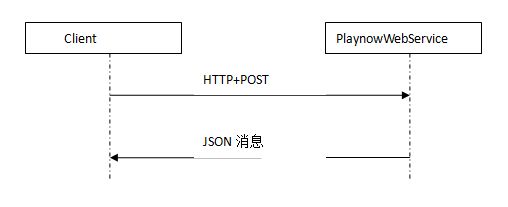

概述
########################################

概述
******************************

Playnow项目中，各终端通过PlaynowWebService来进行数据获取和展现。

本文用于定义PlaynowWebService与各终端之间交互的通信方式和数据格式。其中PlaynowWebService与各终端之间的接口主要涉及到HTTP+JSON协议。

适用范围
******************************

本文详细描述了PlaynowWebService平台与各终端之间的接口，适用于我司PlaynowWebService平台和各相关终端的开发人员，以及相关测试人员或其他需要了解PlaynowWebService平台或有交互需求的人员。

通信方式
******************************

PlaynowWebService平台和各相关客户端之间的通信都是基于HTTP协议，目前只支持客户端以HTTP+POST（请求数据为UTF-8编码）方式进行请求服务端，服务端以JSON消息返回给客户端。

