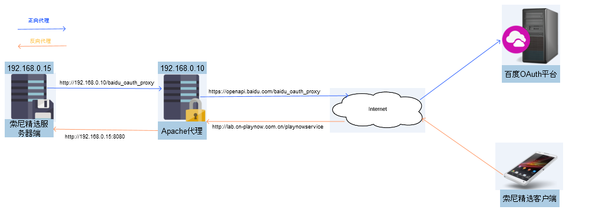
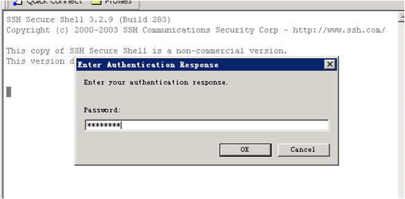

配置代理
########################################

目的
*****************
在开发服务器上配置代理的目的是为了使该服务器上的程序正常的访问Internet以及被Internet访问

预期结果
*****************
在成功配置代理之后，能达到以下两种结果

#. playnowservice能正常访问百度应用搜索的Api，并且能正常调用百度、新浪等OAuth平台的Api(正向代理)，
	
#. 能通过Internet正常访问playnowservice对外的接口(反向代理)

	
准备工作
*****************
这里我们通过主机(以下称为代理服务器) ::

	192.168.0.10
	
上的Apache软件实现代理功能

连接代理服务器
==========================

1. 用SSH远程登陆 172.25.0.101

2. 打开Secure Shell Client

3. 连接apache服务器

4. 输入密码

正向代理
*****************
关于正向代理的定义，可参考apache官方说明 ::

	http://httpd.apache.org/docs/2.2/en/mod/mod_proxy.html
	
下面将以怎样成功通过PlaynowService访问Baidu OAuth平台为例进行说明 ::

1. 输入如下命令编辑apache配置文件httpd.conf ::

	vi /etc/apache2/httpd.conf  	

2. 添加如下配置 ::

	LoadModule proxy_module /usr/lib64/apache2/mod_proxy.so
	LoadModule proxy_connect_module /usr/lib64/apache2/mod_proxy_connect.so
	LoadModule proxy_http_module /usr/lib64/apache2/mod_proxy_http.so
	LoadModule ssl_module /usr/lib64/apache2-prefork/mod_ssl.so

	<IfModule mod_proxy.c>
	ProxyRequests On
	ProxyVia On
	<Proxy *>
	Order deny,allow
	Allow from all
	</Proxy>
	SSLProxyEngine on
	ProxyPass /baidu_oauth_proxy https://openapi.baidu.com
	ProxyPassReverse /baidu_oauth_proxy https://openapi.baidu.com

其中，mod_ssl.so和SSLProxyEngine on都是对HTTPS的代理起作用的

基于上述配置，开发服务器需要从如下地址访问百度的OAuth平台 ::

		http://192.168.0.10/baidu_oauth_proxy/oauth/2.0/token
	
3. 输入以下命令保存对文件httpd.conf的修改 ::
	
	wq

4. 输入以下命令重启Apache ::

	apache2ctl -t
	apache2ctl graceful

5. 用索尼精选5.6及以上客户端能通过百度账户登录	
	
反向代理
*****************
关于反向代理的定义，可参考apache官方说明 ::

	http://httpd.apache.org/docs/2.2/en/mod/mod_proxy.html
	
下面将以怎样成功通过Internet访问以下PlaynowService的URL为例进行说明 ::

	http://lab.cn-playnow.com.cn/playnowservice/ServerApi.ashx
	

1. 输入如下命令编辑apache配置文件default-server.conf ::

	vi /etc/apache2/default-server.conf 
	
2. 添加如下配置 ::

	ProxyPass /playnowservice http://192.168.0.15:8080/
	ProxyPassReverse /playnowservice http://192.168.0.15:8080/
	
其中，192.168.0.15是开发服务器的局域网地址，/playnowservice是对应服务的路径部分（例如：http://lab.cn-playnow.com.cn/playnowservice/ServerApi.ashx）

3. 输入以下命令保存对文件default-server.conf的修改 ::
	
	wq

4. 输入以下命令重启Apache ::

	apache2ctl -t
	apache2ctl graceful

5. 在浏览器中输入如下URL ::

	http://lab.cn-playnow.com.cn/playnowservice/ServerApi.ashx
	
6. 如果看到类似于以下的输出，则表示配置成功 ::

	{"ResultCode":101,"discription":"Sig Error!"}
	
	
	