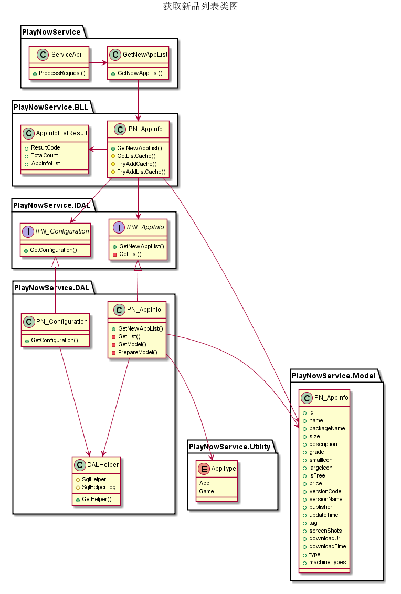
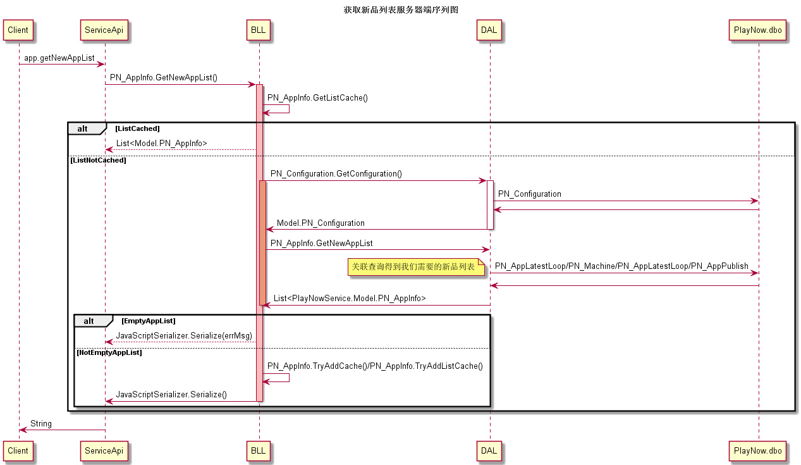
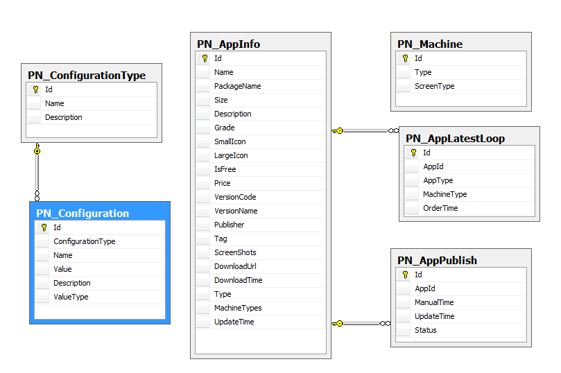

获取新品列表模块
#########################

说明
*******************
此模块用于响应客户端对游戏或应用的新品列表的请求，根据机型分页返回最近发布的游戏或应用。

详细设计图
*******************

流程
*******************
* 服务器端序列图

 
API接口 
*******************
+------------------+----------------------------------------------+
|接口名称          |                     参数                     |
+==================+==============================================+
|app.getNewAppList |  machineType,appType,startIndex,returnNum    |
+------------------+----------------------------------------------+

容错处理
*******************
保留原有app.getNewAppList接口不变，修改服务器端现有逻辑。

传输安全
*******************
N/A

性能实现机制
*******************
N/A

数据库关系
*******************
* 获取新品列表相关数据库关系图

设计模式
*******************
N/A