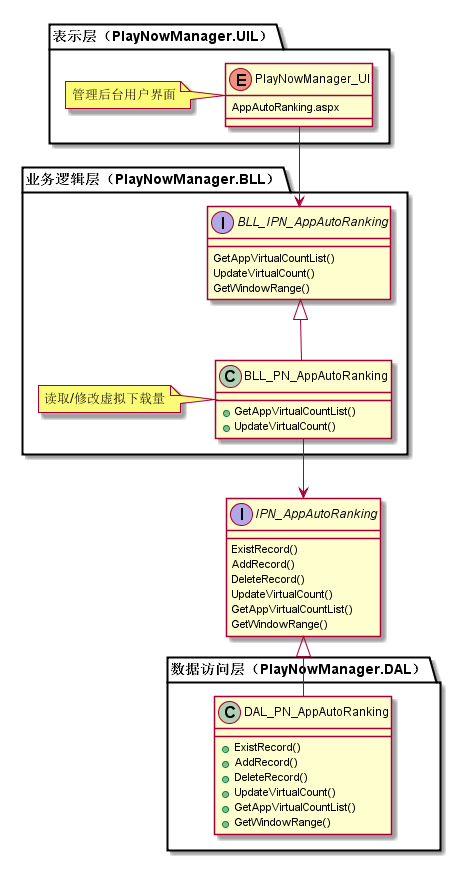
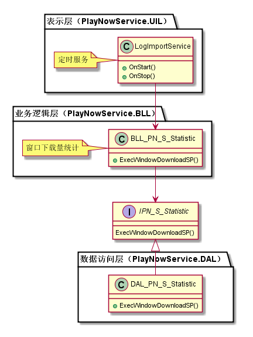
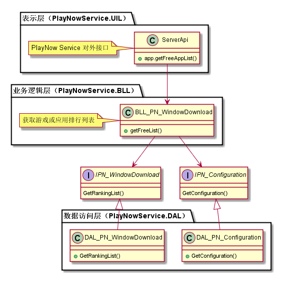
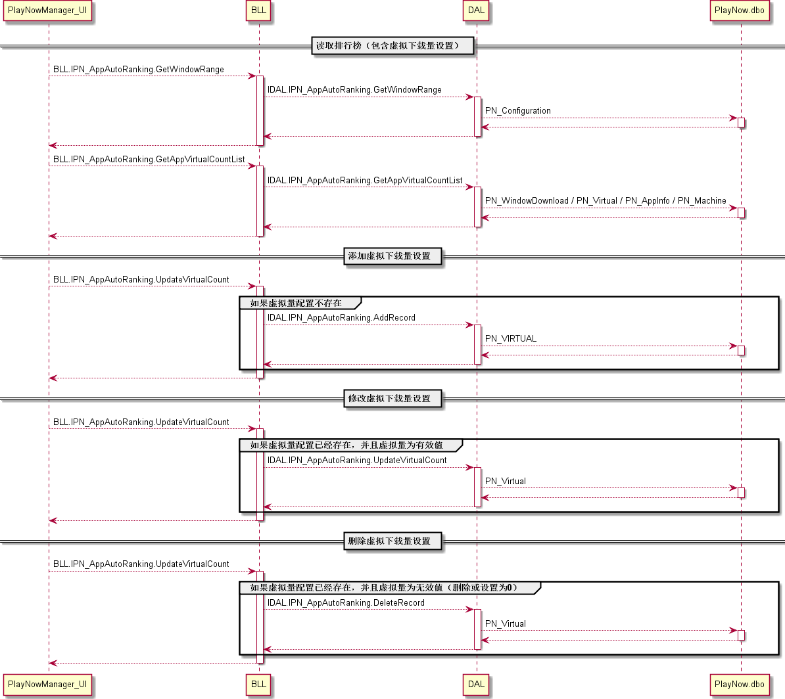
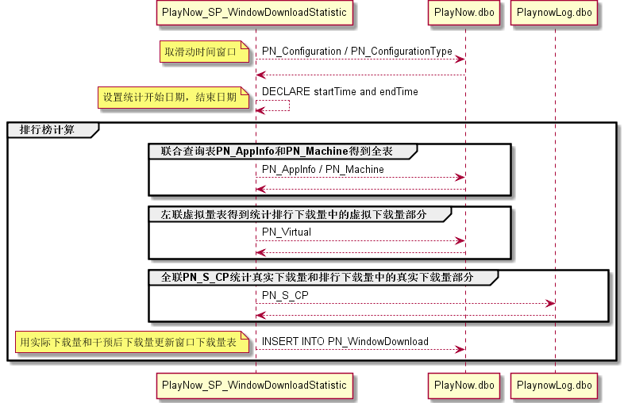
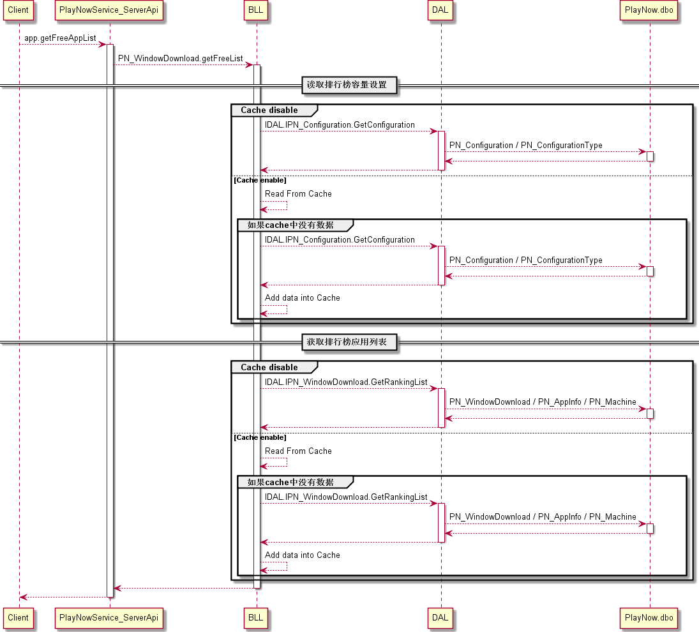
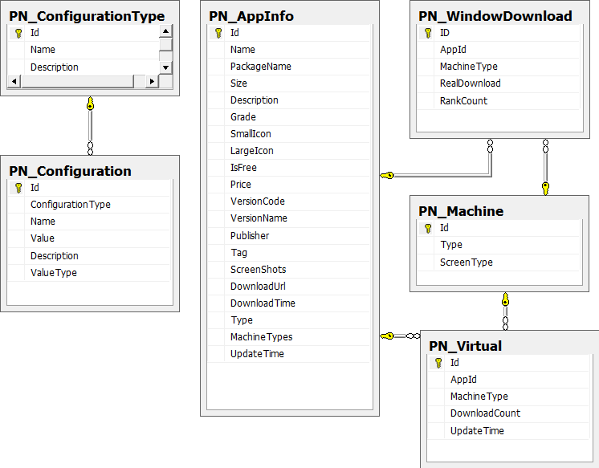

排行榜模块
#########################

说明
*******************
此模块主要负责每日更新设置时间窗口内的下载量排行榜，支持管理后台配置虚拟下载量并参与排行统计。所以此模块分为三个子模块：

* 设置虚拟下载量子模块
* 排行榜统计子模块
* 获取排行列表接口实现子模块

详细设计图
*******************

* 设置虚拟下载量子模块

* 排行榜统计子模块

* 获取排行列表接口实现子模块

流程
*******************

* 设置虚拟下载量子模块

* 排行榜统计子模块

* 获取排行列表接口实现子模块

API接口 
*******************
对客户端接口：

+------------------+-----------------------------------------------+------------------------------------------------+
|接口名称          |       参数                                    |    接口功能                                    |
+==================+===============================================+================================================+
|app.getFreeAppList|appType，order，startIndex，returnNum，withDesc|根据机型获取免费应用排行列表，应用按照下载量排行|
+------------------+-----------------------------------------------+------------------------------------------------+

容错处理
*******************
N/A

传输安全
*******************
N/A

性能实现机制
*******************
N/A

数据库关系
*******************

* 数据库关系：

设计模式
*******************
N/A
