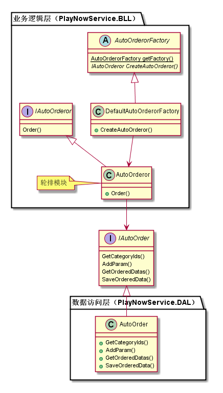
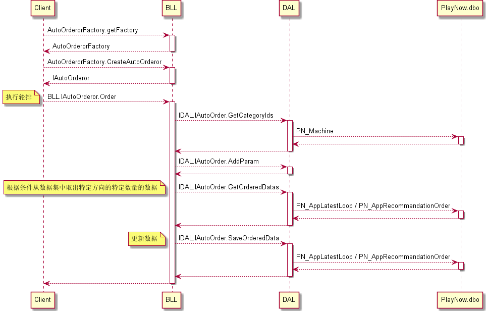

轮排模块
#########################

说明
*******************
此模块主要负责对指定数据表中的某个列进行轮排，由新品模块调用本模块实现新品动态内容集合的轮排，由首页模块调用本模块实现首页内容列表的轮排。

详细设计图
*******************

流程
*******************

API接口 
*******************
对其他模块接口：

+------------------+----------------------------------------+
|接口名称          |       接口功能                         |
+==================+========================================+
|AutoOrderorFactory|这是一个工厂类，用于生成IAutoOrderor对象|
+------------------+----------------------------------------+
|IAutoOrderor      |AutoOrderor接口，用于实现轮排           |
+------------------+----------------------------------------+

容错处理
*******************
N/A

传输安全
*******************
N/A

性能实现机制
*******************
N/A

数据库关系
*******************

设计模式
*******************
N/A
