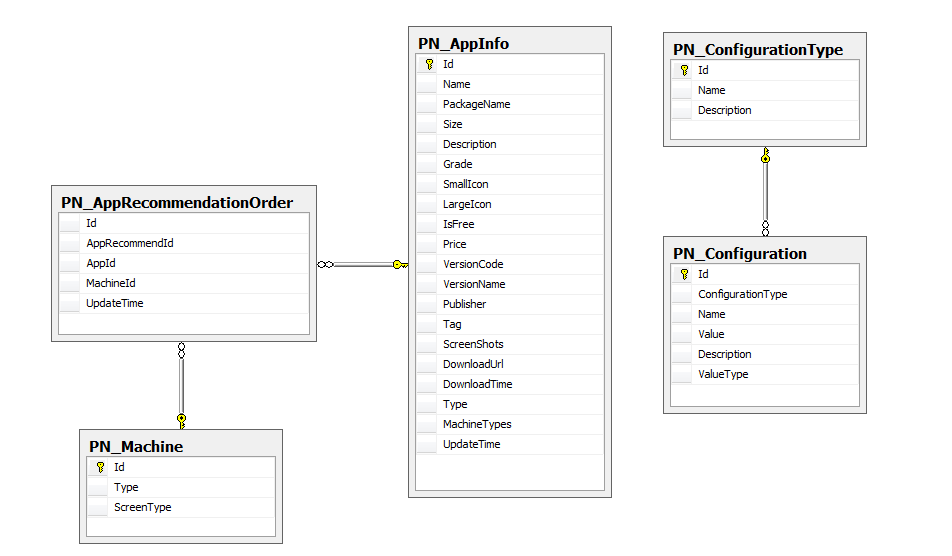

首页推荐模块
#########################

说明
*******************
此模块用于在Android客户端和Web网页首页显示推荐列表，并次日可以将列表的底部的三条数据显示在列表顶部

详细设计图
*******************
该模块分为两个子模块，获取首页推荐列表子模块和轮排首页推荐列表子模块。获取首页推荐列表模块对原有的首页推荐列表模块设计未做任何修改，将继续遵循先前设计。轮排列表顶部三条数据请参考轮排模块设计文档。

* 获取首页推荐列表子模块

   
* 轮排首页推荐列表子模块

流程
*******************
继续遵循原有设计流程
 
API接口 
*******************
+------------------+----------------------------------------------------------------------------+
|接口名称          |                                       参数                                 |
+==================+============================================================================+
|app.getList       |  machineType,appRecommendationId,startIndex,returnNum,withdesc,WithType    |
+------------------+----------------------------------------------------------------------------+

容错处理
*******************
保留原有app.getList接口不变，修改服务器端现有逻辑。

传输安全
*******************
N/A

性能实现机制
*******************
N/A

数据库关系
*******************
* 获取首页推荐列表相关数据库关系图

设计模式
*******************
N/A