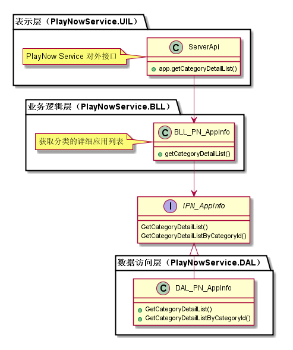
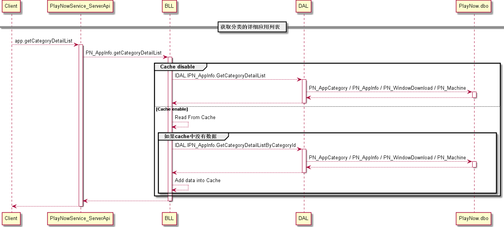
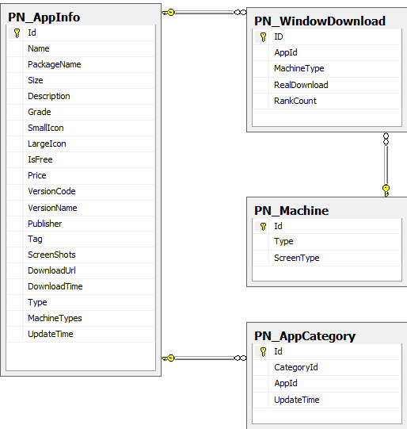

分类模块
#########################

说明
*******************
此模块主要实现对客户端的接口，按分类标识提供分类的详细应用列表。

详细设计图
*******************

流程
*******************

API接口 
*******************
对客户端接口：

+-------------------------+---------------------------------+------------------------------+
|接口名称                 |       参数                      |    接口功能                  |
+=========================+=================================+==============================+
|app.getCategoryDetailList|categoryId，startIndex，returnNum|根据机型获取分类的详细应用列表|
+-------------------------+---------------------------------+------------------------------+

容错处理
*******************
N/A

传输安全
*******************
N/A

性能实现机制
*******************
N/A

数据库关系
*******************

* 数据库关系：

设计模式
*******************
N/A
