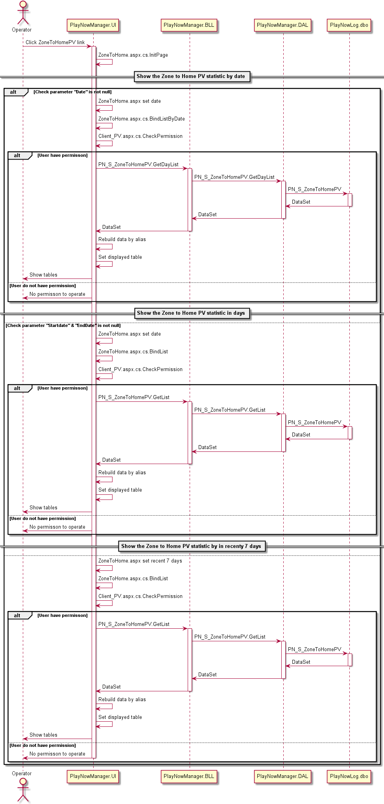

多专区模块
#########################

说明
*******************
此模块主要实现对客户端的接口，按分类标识提供分类的详细应用列表。

详细设计图
*******************
*  PlayNowService获取专区数据 
 .. image:: images/multizone_ps_zone_classes.png
*  PlayNowManager显示专区数据 
 .. image:: images/multizone_pn_zone_classes.png
*  日志导入与统计 
 .. image:: images/multizone_logs_classes.png
*  后台管理系统 
 .. image:: images/multizone_statistic_classes.png

流程
*******************

*  增加新专区

*  修改专区信息

*  获取专区列表

*  写入日志

*  由日志导入数据库

*  获取“Client-PV”的统计数据

*  获取“由zone到首页”的统计数据

*  导出“由zone到首页”的统计数据

API接口 
*******************
对客户端接口：

+---------------+-------------------------------------------+------------------------------+
|接口名称       |                 参数                      |    接口功能                  |
+===============+===========================================+==============================+
|zone.getAppList|machineType，zoneId，startIndex，returnNum |根据机型获取专区列表          |
+---------------+-------------------------------------------+------------------------------+
|log.addInfo    |Type，Message                              |书写日志接口                  |
+---------------+-------------------------------------------+------------------------------+

容错处理
*******************
无

传输安全
*******************
无

性能实现机制
*******************
无

数据库关系
*******************

*  多专区数据库关系图
 .. image:: images/Zone_DB.png
*  PV统计数据库关系图
 .. image:: images/PV_DB.png

设计模式
*******************
无
