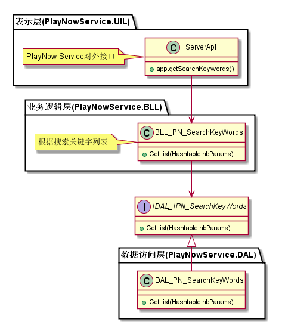
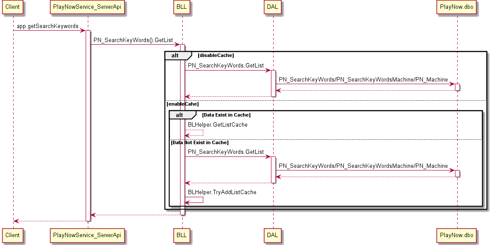

搜索关键字列表模块
#########################

说明
*******************
此模块主要实现客户端的接口，按机型提供搜索关键字列表。

详细设计图
*******************

流程
*******************

API接口 
*******************
对客户端接口

+-------------------------+---------------------------------+------------------------------+
|接口名称                 |       参数                      |    接口功能                  |
+=========================+=================================+==============================+
|app.getSearchKeywords    |MachineType                      |根据机型获取搜索关键字列表    |
+-------------------------+---------------------------------+------------------------------+

容错处理
*******************
无

传输安全
*******************
无

性能实现机制
*******************
无

数据库关系
*******************
.. image:: _static/database_relative.png

设计模式
*******************
无
