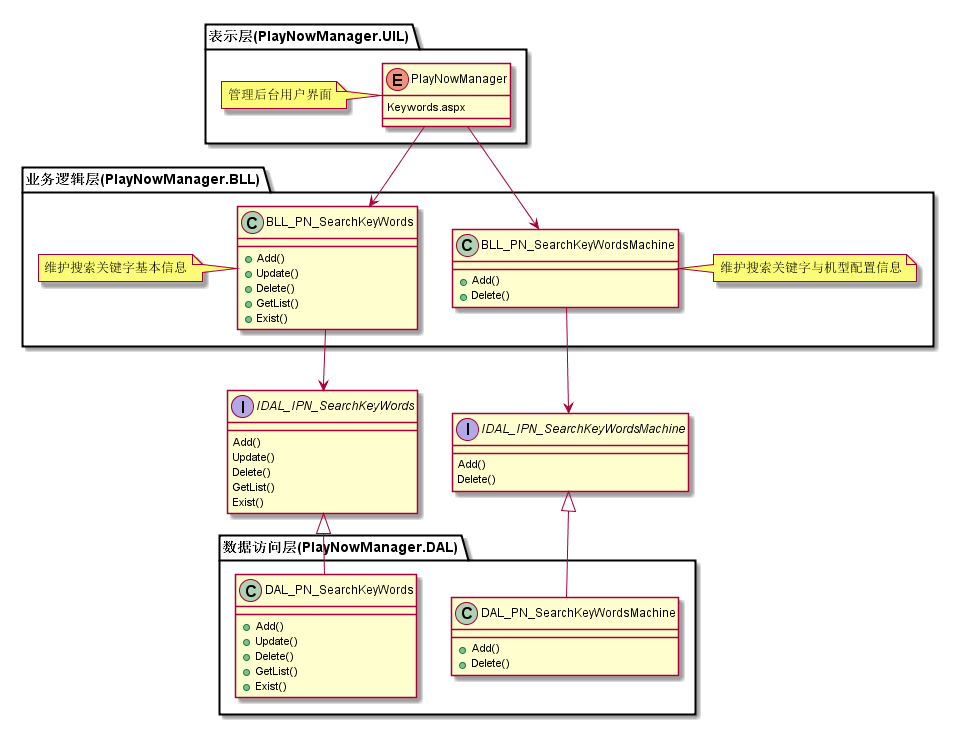
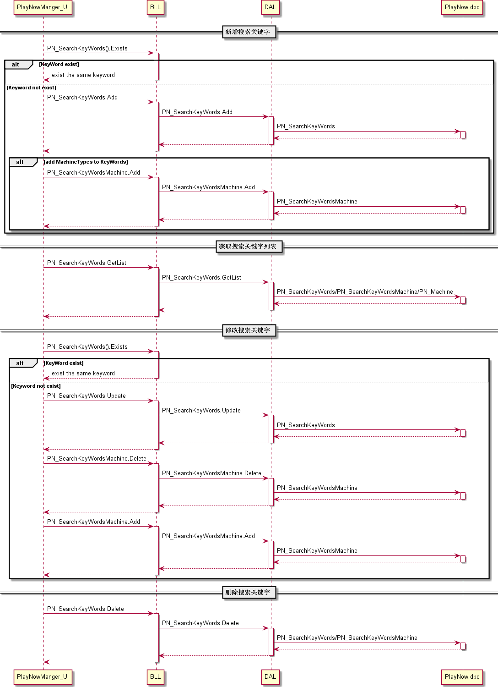
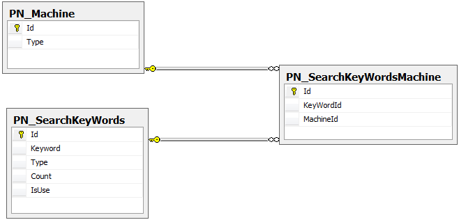

搜索关键字管理模块
#########################

说明
*******************
此模块主要实现维护关键字信息，包括关键字与机型的配置。

详细设计图
*******************

流程
*******************

API接口 
*******************
无

容错处理
*******************
无

传输安全
*******************
无

性能实现机制
*******************
无

数据库关系
*******************

设计模式
*******************
无
