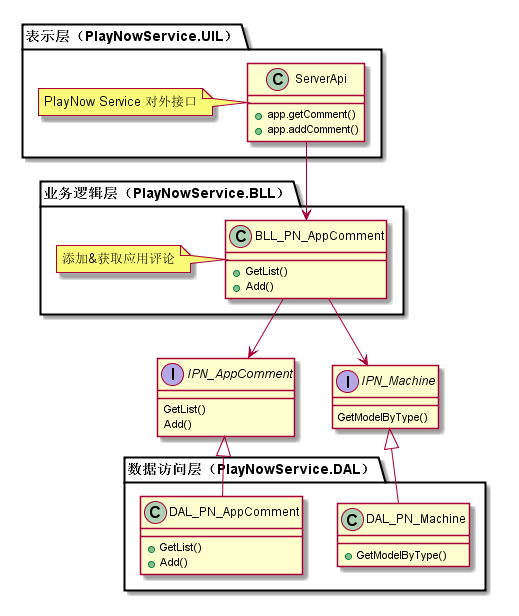
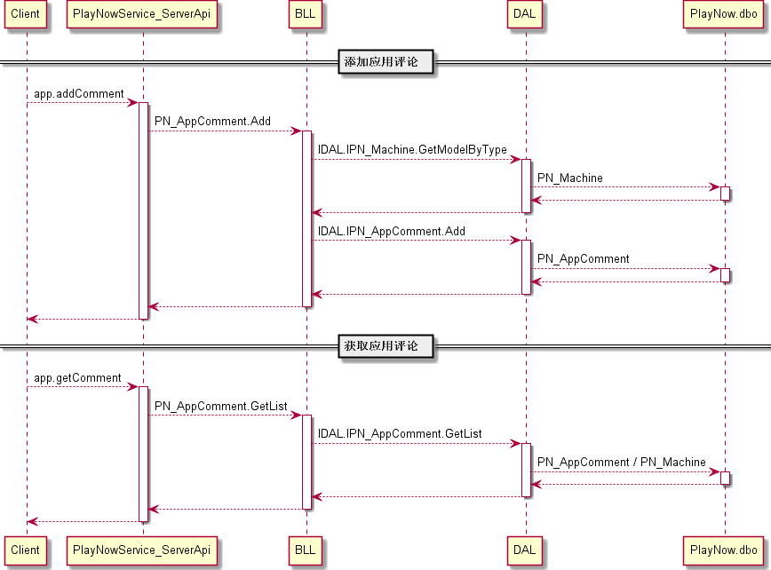
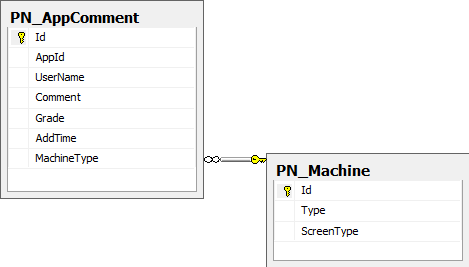

用户评论模块
#########################

说明
*******************
本模块分为两部分，添加用户评论和获取用户评论。

 * 添加用户评论：实现对外接口app.addComment，保存用户评论到数据库。
   修改部分：添加评论用户的机型。
 * 获取用户评论：实现对外接口app.getComment，从数据库中读取用户评论并返回给客户端。
   修改部分：返回消息体中用户名为“来自[机型]”。

详细设计图
*******************

流程
*******************

API接口 
*******************
模块对客户端接口：

+------------------+-----------------------------------------------+------------------------------------------------+
|接口名称          |       参数                                    |    接口功能                                    |
+==================+===============================================+================================================+
|app.addComment    |appId，userName，comment，grade                |支持用户对应用添加评论                          |
+------------------+-----------------------------------------------+------------------------------------------------+
|app.getComment    |appId，startIndex，returnNum                   |支持用户获取应用的评论信息                      |
+------------------+-----------------------------------------------+------------------------------------------------+

容错处理
*******************
无

传输安全
*******************
无

性能实现机制
*******************
无

数据库关系
*******************

设计模式
*******************
无
