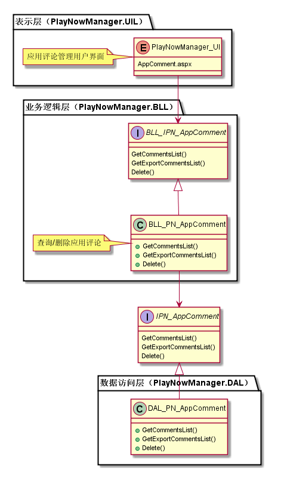
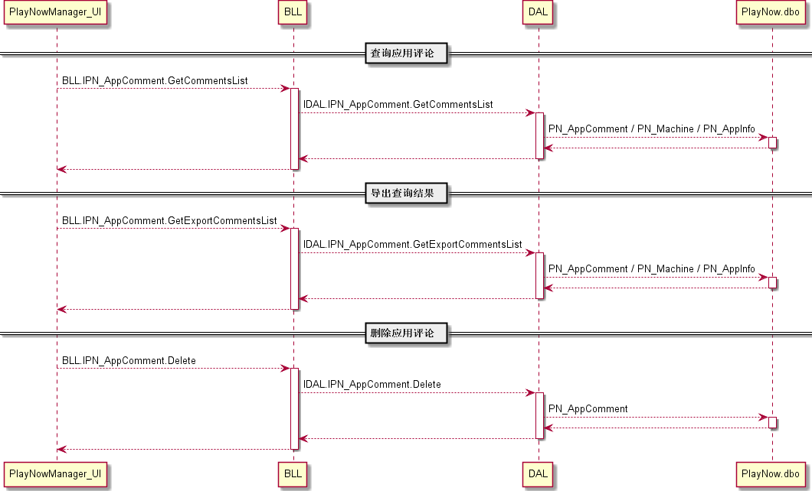
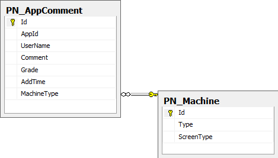

应用评论管理模块
#########################

说明
*******************
这是一个新增模块，在管理后台实现对用户评论的管理，用户可以按条件查询用户评论，可以删除用户评论。

详细设计图
*******************

流程
*******************

API接口 
*******************
无

容错处理
*******************
无

传输安全
*******************
无

性能实现机制
*******************
无

数据库关系
*******************

设计模式
*******************
无
