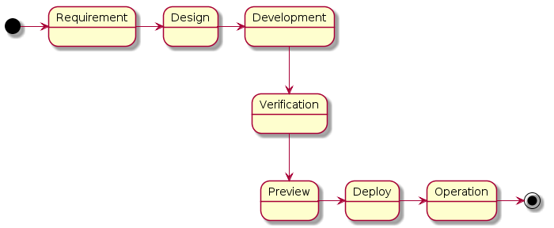
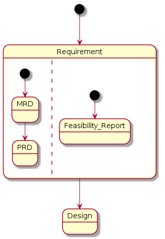
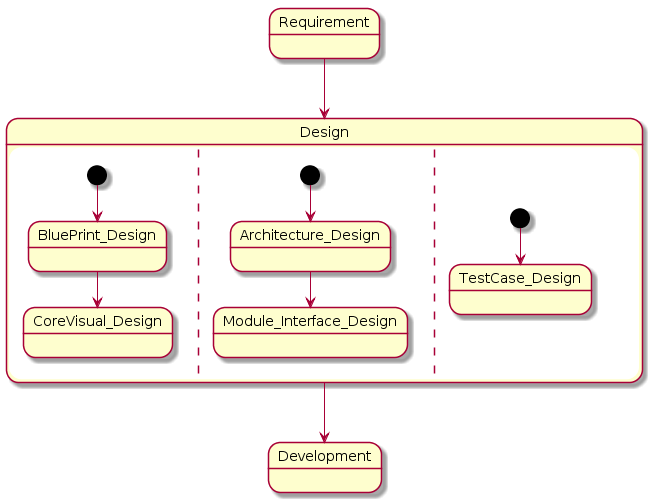
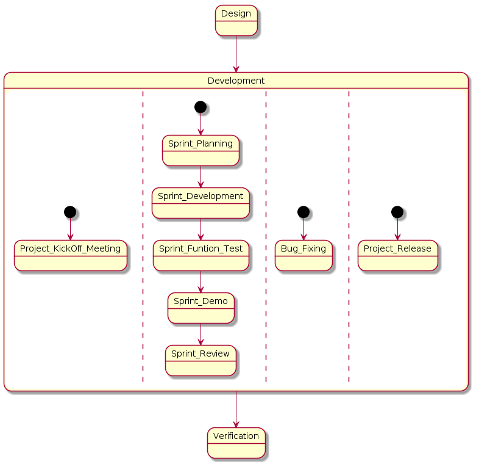
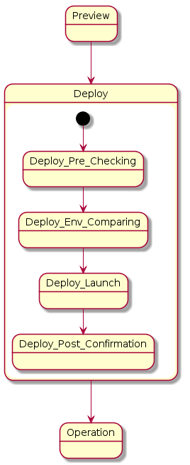
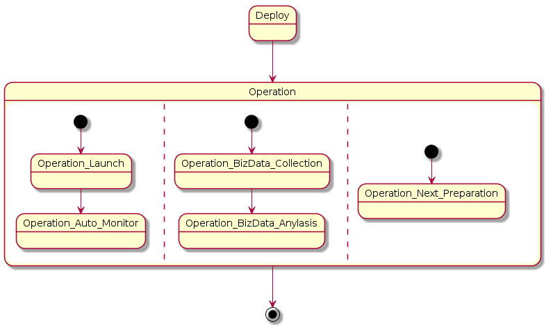
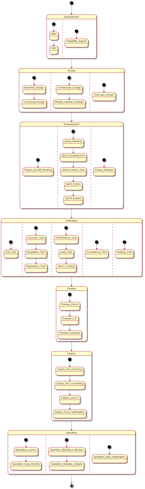

.. 以两个点开始的内容是注释。不会出现编写的文档中。但是能体现文档书写者的思路。
.. 一般一个文件，内容，逻辑的分层，分到三级就可以， 最多四级. 也就是 
   H1. ########
   H2, ********
   H3, =================================================================
   H4. ---------
   

Overall Picture
###################################################

Background
****************************

.. 这个文档设计的背景，为何要设计这个文档，这个文档的来源基础，设计基础是什么之类的信息。

why do we need to make this docs?

Goals
****************************

.. 解释这个文档中会涉及到的一些专业属于，如何让别人很容易文档中所描述的。

we make this documents based on the best practices on developers,so we want to make this docs to describe
how we can develop a service system, from ideas to real running service system.

Overall picture for process
**************************************

Defintion for Process phase
=============================================================

#. Requirement
#. Design
#. Development
#. Verification
#. Preview
#. Deploy
#. Operation

Introduction of Requirement
===============================================================================

Introduction of Design
==================================================================================

Introduction of Development
===================================================================================

Introduction of Verification
====================================================================================

.. image:: images/05_verification_intro.png

Introduction of Preview
====================================================================================
.. image:: images/06_preview_intro.png

Introduction of Deploy
=====================================================================================

Introduction of Operation
=====================================================================================

Reference for overall sub taskes
=====================================================================================

