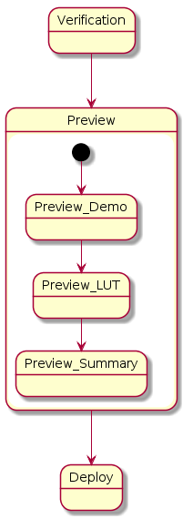

.. 以两个点开始的内容是注释。不会出现编写的文档中。但是能体现文档书写者的思路。
.. 一般一个文件，内容，逻辑的分层，分到三级就可以， 最多四级. 也就是 
   H1. ########
   H2, ********
   H3, =================================================================
   H4. ---------
   

Overall Picture
###################################################

Background
****************************

.. 这个文档设计的背景，为何要设计这个文档，这个文档的来源基础，设计基础是什么之类的信息。

The Service-Dev team is a new team foucses on service and cloud development and web application delivery.
But there are no exist development process or practicable guideline in China local site to guide development on service area.
 

Goals
****************************

.. 解释这个文档中会涉及到的一些专业属于，如何让别人很容易文档中所描述的。

We make this documents based on the best practices on developers,so we want to make this docs to describe
how we can develop a service system, from ideas to real running service system.

Overall picture for process
**************************************

Defintion for Process phase
=============================================================

#. Requirement
	Requirements analysis in systems engineering and software engineering, encompasses those tasks that go into determining the needs or conditions to meet for a new or altered product, taking account of the possibly conflicting requirements of the various stakeholders, analyzing, documenting, validating and managing software or system requirements.
#. Design		
	Software design is the process by which an agent creates a specification of a software artifact, intended to accomplish goals, using a set of primitive components and subject to constraints. Software design may refer to either "all the activities involved in conceptualizing, framing, implementing, commissioning, and ultimately modifying complex systems" or "the activity following requirements specification and before programming"
#. Development	
	Software development is the process of writing and maintaining the source code, whose goals are ultimate implementation of the planned features and product delivery. 
#. Verification	
	Software testing is an investigation conducted to provide stakeholders with information about the quality of the product or service under test.[1] Software testing can also provide an objective, independent view of the software to allow the business to appreciate and understand the risks of software implementation. Test techniques include, but are not limited to, the process of executing a program or application with the intent of finding software bugs (errors or other defects).
#. Preview		
	Preview version software is often useful for demonstrations and previews within an organization and to prospective customers, and customer of the organization that develops the software willing to test the software and feeback for bugfix and new requirement collection. 
#. Deploy		
	The general deployment process consists of several interrelated activities with possible transitions between them, such as "Release", "Install and activate", "Deactivate", "Version tracking", "Uninstall" and so on.
#. Operation	
	Secure that all relevant stakeholder are aware of and are continuously updated on planned and un-planned disruptions.

Introduction of Requirement
===============================================================================

.. image:: images/02_requirement_Intro.png

#MRD
#PRD
#Feasibility Report

Introduction of Design
==================================================================================

.. image:: images/03_design_Intro.png

#Blueprint Design
#Corevisual Design

Introduction of Development
===================================================================================

.. image:: images/04_development_intro.png

Introduction of Verification
====================================================================================

.. image:: images/05_verification_intro.png

Introduction of Preview
====================================================================================

Introduction of Deploy
=====================================================================================
.. image:: images/07_deploy_intro.png

Introduction of Operation
=====================================================================================
.. image:: images/08_operation_intro.png

Reference for overall sub taskes
=====================================================================================

