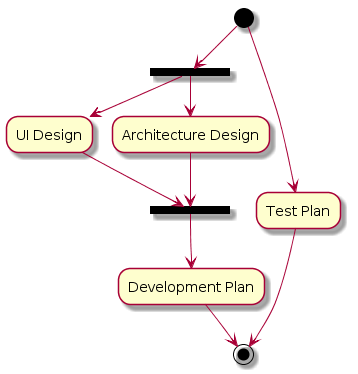

.. 以两个点开始的内容是注释。不会出现编写的文档中。但是能体现文档书写者的思路。
.. 一般一个文件，内容，逻辑的分层，分到三级就可以， 最多四级. 也就是 
   H1. ########
   H2, ********
   H3, =========
   H4. ---------
   

Design
###################################################

Background
****************************

.. 这个文档设计的背景，为何要设计这个文档，这个文档的来源基础，设计基础是什么之类的信息。

Glossary
****************************

.. 解释这个文档中会涉及到的一些专业属于，如何让别人很容易文档中所描述的。

Goal
****************************

Process Definition
********

Process Overall
=========

Roles
=========

* Project Manager
* UI Designer
* System Architect
* Tester

Entry Criteria
=========

Inputs or triggers
---------

Requirement Documentation Ready

* MRD
* PRD
* User Stories

Task -- UI Design
=========

Role
---------

* UI Desinger

Task Definition
---------

Validation
---------

Outputs
---------

* Blue Print
* Core Visual
* Icon

Task -- Architecture Design
=========

Role
---------

* System Architect

Task Definition
---------

Validation
---------

Outputs
---------

* Overall Design Document
* Module Design Docuement
* Component Design Document

Task -- Test Plan
=========

Role
---------

* Tester

Task Definition
---------

Validation
---------

Outputs
---------

* Test Plan
* Test Case

Task -- Development Plan
=========

Role
---------

* Project Manager

Task Definition
---------

Validation
---------

Outputs
---------

* Development Plan Document

Exit Criteria
=========

Outputs
---------

Design Documentation

* Blue print
* Core visual
* Overall Arch Design

Others
****************************

Summary
****************************

