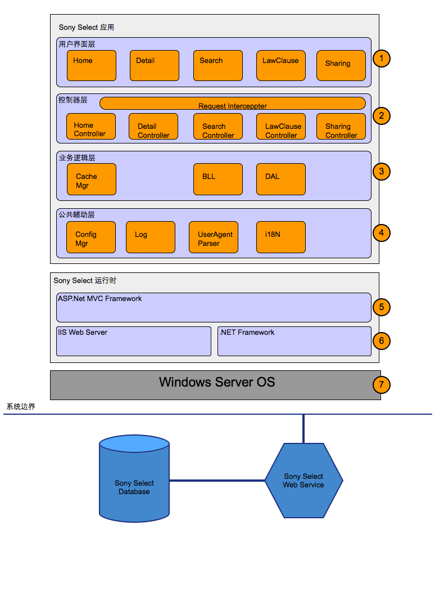

系统架构设计简述
###########################

.. 这些注释不会在文档中生成。

.. 系统架构设计的文档思路是，首先介绍业务的背景，让大家明白我们为什么而设计，然后解释一下，我们可能要在描述中用到的一些术语。这些术语会帮助
   读者很快的能理解我们接下来要阐述的内容。在开始设计之前，需要让大家了解下我们的设计目标是什么，这个是跟背景介绍不同。一个偏向业务，一个
   偏向如何通过技术的设计来满足这些业务需求。
   
.. 然后，会给读者介绍下自己的设计策略。有业务背景，有术语，有设计目标，那么我们通过什么样的设计策略来满足这些目标？
   通过这些系统的铺垫，才有了第一个产出: 系统架构图。就是我们为何设计了这样的一个架构？
   
.. 系统架构图，应该让读者能从高屋建瓴的层面，能感受到架构师，对业务层面的需求，一步一步的肢解满足。有了基本的肢解满足，然后可能会动态的描述，如何交互协作
   这个架构，是如何从软件的层面来满足一个真实世界的业务需求。

.. 等大家明白了这个系统架构，我们接下来，应该是对每个架构的分层，或者分模块，或者组件， 来进行更细一节的阐述。这个阐述应该放到具体的业务单元的分层或者分模块中来阐述。

.. 最后给读者一个总结，总结架构师在系统设计中的一些需要读者着重注意的事情。精炼的总结。

.. 作为一个完整的文档，应该有一个其它的部分，不涉及到以上的内容，但是有必要提出来的，都可以放到这个部分。

.. 有了思路，文档应该就是比较顺利了，这就是我们经常说的align 大纲。

系统架构设计的文档思路是，首先介绍业务的背景，让大家明白我们为什么而设计，然后解释一下，我们可能要在描述中用到的一些术语。这些术语会帮助
   读者很快的能理解我们接下来要阐述的内容。在开始设计之前，需要让大家了解下我们的设计目标是什么，这个是跟背景介绍不同。一个偏向业务，一个
   偏向如何通过技术的设计来满足这些业务需求。
   
然后，会给读者介绍下自己的设计策略。有业务背景，有术语，有设计目标，那么我们通过什么样的设计策略来满足这些目标？
   通过这些系统的铺垫，才有了第一个产出: 系统架构图。就是我们为何设计了这样的一个架构？
   
系统架构图，应该让读者能从高屋建瓴的层面，能感受到架构师，对业务层面的需求，一步一步的肢解满足。有了基本的肢解满足，然后可能会动态的描述，如何交互协作
   这个架构，是如何从软件的层面来满足一个真实世界的业务需求。

等大家明白了这个系统架构，我们接下来，应该是对每个架构的分层，或者分模块，或者组件， 来进行更细一节的阐述。这个阐述应该放到具体的业务单元的分层或者分模块中来阐述。

最后给读者一个总结，总结架构师在系统设计中的一些需要读者着重注意的事情。精炼的总结。

作为一个完整的文档，应该有一个其它的部分，不涉及到以上的内容，但是有必要提出来的，都可以放到这个部分。

有了思路，文档应该就是比较顺利了，这就是我们经常说的align 大纲。

架构设计重点在于将系统分层并产生层次内的模块、阐明模块之间的关系 )

设计背景
****************************

.. 因为什么要设计这个架构图？

术语解释
****************************

.. 解释我们的设计架构要用到什么术语，如何让别人很容易理解我们所说的。

设计目标
****************************

.. 设计的目的是什么？

以下是我们的设计目标:

#. 松耦合、分布式开发
	* Default Web Page与PlayNow Service通过接口协议通信，提供了分布式开发的基础。
#. 重用
	* 重用PlayNow Service APIs，减少重复逻辑，简化代码。
#. 易维护
	* Default Web Page功能独立，职责清晰，Bug易于定位，修改。
	* Default Web Page的功能改动、新增，对PlayNow Service功能无影响， 并降低测试范围。
#. 扩展性
	* Default Web Page预留接口可以直接或通过其他形式访问PlayNow数据库数据。为特殊需求提供实现方式。

系统架构设计详解
###########################

架构设计策略
****************************

#. 核心架构技术
	* MVC三层架构， 基于.Net MVC
#. 无状态处理设计
	* 标准Web应用多线程支持
	* Default Web Page代码均为无状态处理，处理请求的流程中不会因代码编写的错误产生线程安全问题及并发问题。
#. 组件通信设计
	* UI页面与控制器层通过Json形式通信
	* Default Web Page与PlayNow Service通过HTTP协议通信

系统架构设计图解
****************************

系统架构图
================================

.. (不确定),需要讨论三级标题

系统关系图
================================

.. (不确定),需要讨论三级标题

给予以上的内容，让我们来看看架构中各组件或者各模块，各分层之间是如何动态交互的。

#. 从分层中来看
	* something
#. 从分模块来看
#. 从分组件来看
#. 从分业务来看

系统模块介绍
#################################

表示层
****************************

模块一
==================================

#. 组件A
#. 组件B
#. 组件C

模块二
==================================

#. 组件A
#. 组件B
#. 组件C

控制层
****************************

模块一
==================================

#. 组件A
#. 组件B
#. 组件C

模块二
==================================

#. 组件A
#. 组件B
#. 组件C

业务逻辑层
****************************

模块一
==================================

#. 组件A
#. 组件B
#. 组件C

模块二
==================================

#. 组件A
#. 组件B
#. 组件C

公共辅助层
****************************

模块一
==================================

#. 组件A
#. 组件B
#. 组件C

模块二
==================================

#. 组件A
#. 组件B
#. 组件C

系统架构设计总结
###########################

其它
###########################

修改版本信息
****************************

==================== ==================== ==================== ====================
 版本                   日期                  修改人				 修改信息
==================== ==================== ==================== ====================
 1.0.0                 2013-1-9            JiaoYan               初始版本

==================== ==================== ==================== ====================

